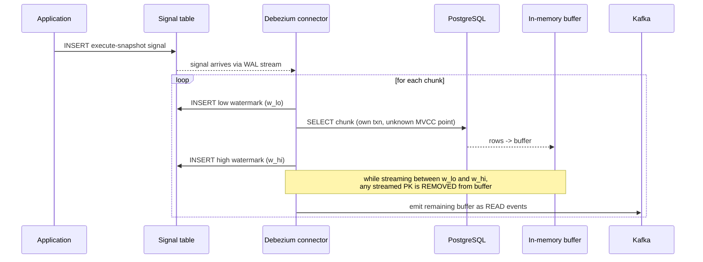
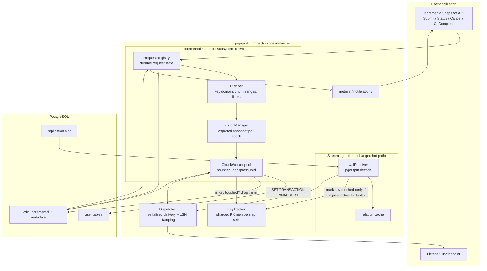
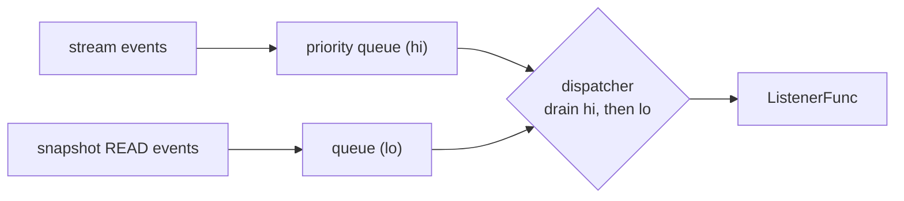
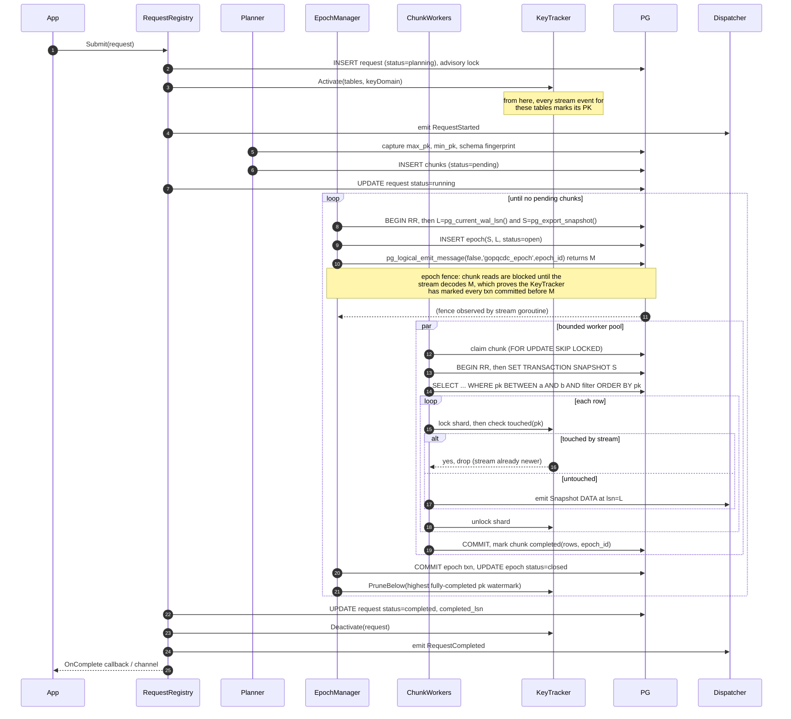
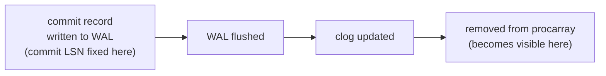
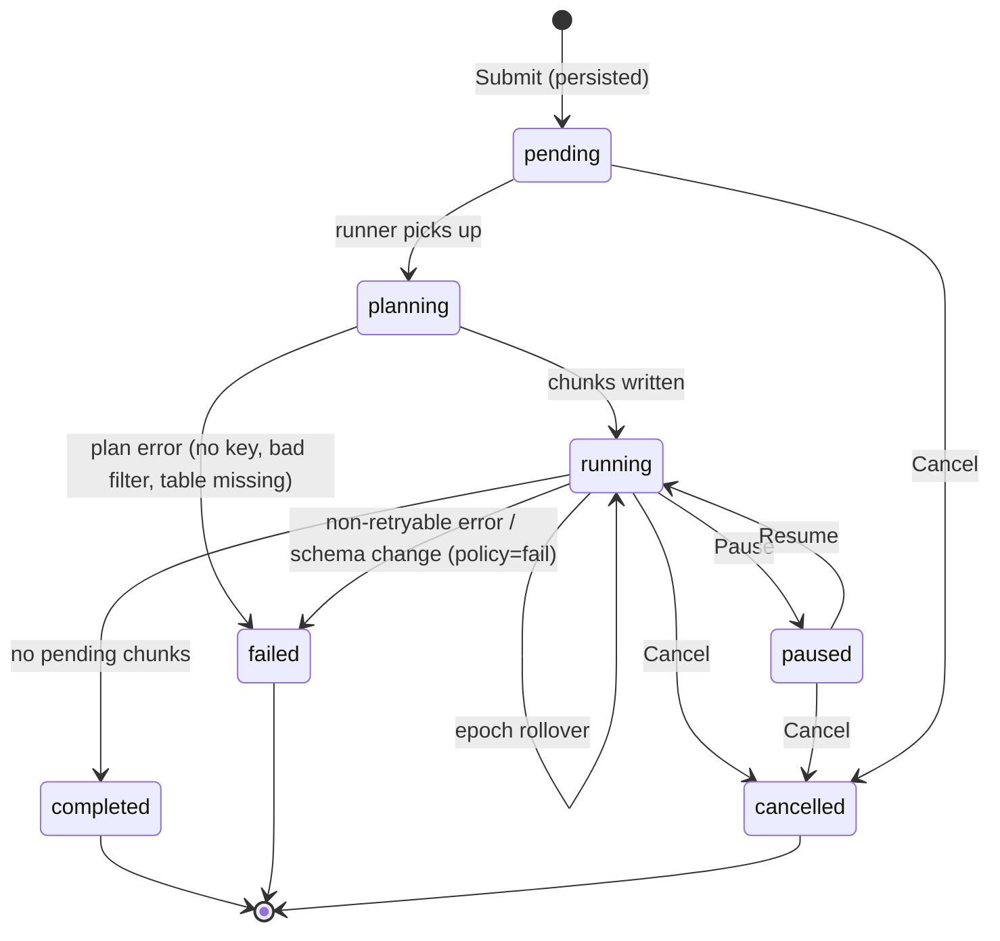
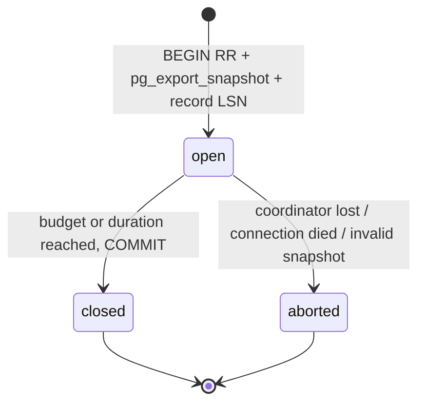
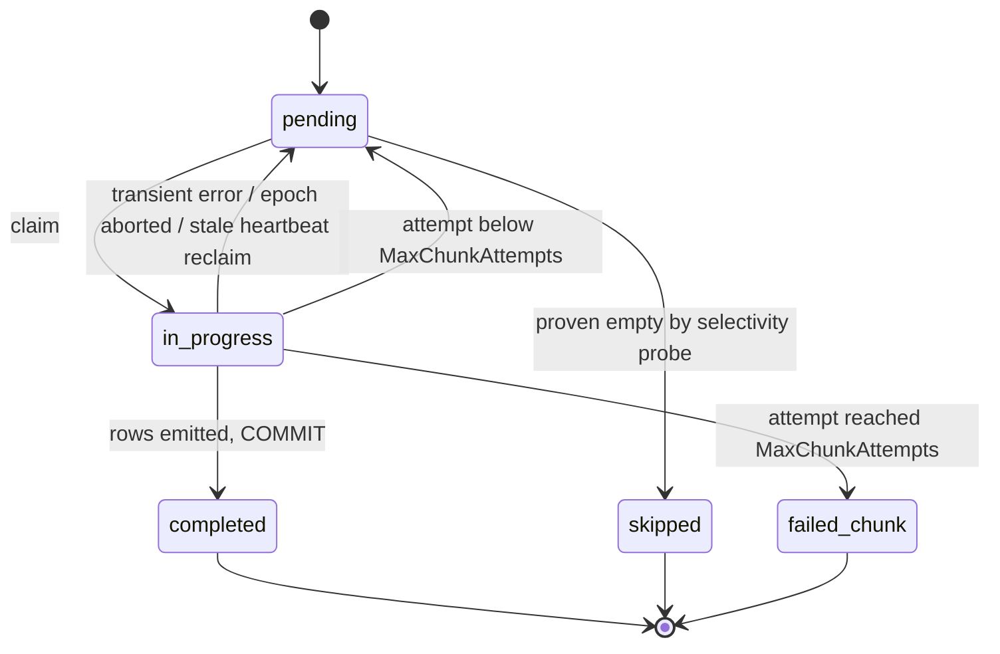
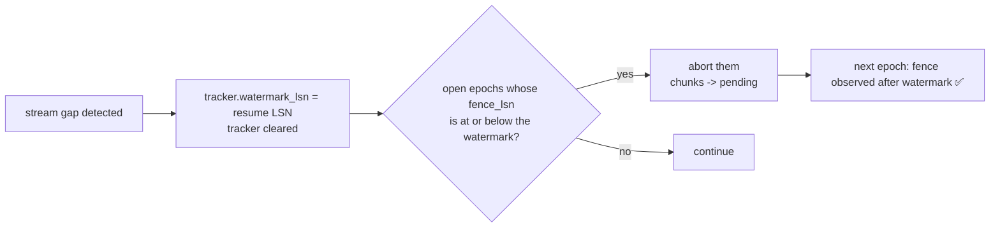

# Incremental Snapshots for go-pq-cdc

> **Status:** Design (research phase complete)
> **Target:** PostgreSQL 14+ (validated on 18.4), pgoutput protocol v1–v4
> **Scope:** Ad-hoc, on-demand, resumable re-reads of table subsets that run **concurrently with live logical replication**, without pausing the stream.

---

## Table of contents

1. [D1 — Story, goals, non-goals](#d1--story-goals-non-goals)
2. [D2 — Debezium reference and where we deliberately differ](#d2--debezium-reference-and-where-we-deliberately-differ)
3. [D3 — Current state and gap analysis](#d3--current-state-and-gap-analysis)
4. [D4 — Architecture](#d4--architecture)
5. [D5 — Core epoch algorithm](#d5--core-epoch-algorithm)
6. [D6 — Key domain, chunking and filters](#d6--key-domain-chunking-and-filters)
7. [D7 — Deduplication and memory model](#d7--deduplication-and-memory-model)
8. [D8 — Public driver API](#d8--public-driver-api)
9. [D9 — Persistence schema and coordination](#d9--persistence-schema-and-coordination)
10. [D10 — Lifecycle state machines](#d10--lifecycle-state-machines)
11. [D11 — Failure and edge-case matrix](#d11--failure-and-edge-case-matrix)
12. [D12 — Schema evolution](#d12--schema-evolution)
13. [D13 — Performance, memory and backpressure](#d13--performance-memory-and-backpressure)
14. [D14 — Observability, notifications, security](#d14--observability-notifications-security)
15. [D15 — Test plan and acceptance criteria](#d15--test-plan-and-acceptance-criteria)

Implementation tasks live in [INCREMENTAL_SNAPSHOT_TASKS.md](INCREMENTAL_SNAPSHOT_TASKS.md).

---

## D1 — Story, goals, non-goals

### 1.1 The story

> **As** the owner of a search-indexing service fed by go-pq-cdc,
> **I want** to ask a running connector to re-read a defined subset of rows — a whole table, a shard of a table, everything changed since a timestamp, or everything matching a predicate —
> **so that** I can repair the sink after a bad deploy, backfill a newly added column, onboard a new table, or re-hydrate one shard,
> **without** stopping the connector, dropping the replication slot, replaying the whole WAL, or taking a full re-snapshot of a 100M-row table.

Three concrete situations that motivate the feature:

**Sink corruption after a bad deploy.** A transformation bug wrote wrong values into the search index for orders in a two-hour window. The WAL for that window is long gone (`max_slot_wal_keep_size` reclaimed it). Today the only remedy is `Resnapshot: true`, which tears down and re-reads *everything* and, in `initial` mode, does so *before* CDC resumes — so the pipeline stalls for the full duration of a 100M-row read. What is actually needed is: "re-read the ~400k rows whose `updated_at` falls in that window, while the stream keeps running."

**Onboarding a new table.** A table is added to the publication. Streaming picks up new changes immediately, but the sink has no history. Today this needs a full connector restart with `Resnapshot`, which also re-reads every other table. What is needed is: "snapshot only `public.shipments`, live, now."

**Shard re-hydration under horizontal scaling.** The deployment runs N connector instances, each owning a hash shard of the key space (see `benchmark/benchmark_initial/SCALING_GUIDE.md`). One instance's sink partition was lost. What is needed is: "instance 7, re-read your shard only" — expressed as a filter such as `hashtextextended(id::text, 0) % 16 = 7`.

### 1.2 Goals

| # | Goal | Measurable form |
|---|---|---|
| G1 | Ad-hoc snapshot of a table subset **while streaming continues** | Streaming lag (`confirmed_flush_lsn` → `pg_current_wal_lsn`) increases by < 5% p99 during an incremental snapshot |
| G2 | **At-least-once delivery of the latest copy** of every row in the requested set | Chaos suite: after any single-fault injection, every row in the request set is delivered at least once and the final delivered value equals the DB value at completion time |
| G3 | **Duplicate minimisation**, not just tolerance | ≤ 0.1% of emitted snapshot rows are duplicates of a stream event already emitted for the same key, under a 20%-write workload |
| G4 | Bounded, predictable memory | Steady-state heap attributable to an in-flight incremental snapshot ≤ 64 MiB by default, hard-capped and configurable; independent of table size |
| G5 | Resumable across process restart, PG failover, and network partition | Restart at any point resumes from durable chunk state; no chunk is lost, no full restart of the request |
| G6 | No long-lived transactions | No snapshot transaction lives longer than `EpochMaxDuration` (default 60s); PG `xmin` horizon advances between epochs |
| G7 | Clear driver API for submission, filtering, progress, and completion notification | Public Go API; no config-file restart required to start a snapshot |
| G8 | Works alongside the existing `initial` / `snapshot_only` modes without regressing them | Existing integration suite passes unmodified |
| G9 | Horizontal-scaling friendly | Request filters can express a hash shard; each instance snapshots only its own shard |

### 1.3 Non-goals

| # | Non-goal | Rationale |
|---|---|---|
| N1 | Exactly-once delivery | Impossible without sink-side transactional coordination. We give at-least-once + aggressive dedup. Documented explicitly. |
| N2 | Snapshotting a table whose **primary key changes value** mid-request | Stated as out of scope by the requester. PK values are assumed immutable; DDL that renames/retypes the PK aborts the request (see [D12](#d12--schema-evolution)). |
| N3 | Cross-instance global ordering under horizontal scaling | Each instance owns a disjoint key shard; ordering is per-key, which is what sinks need. |
| N4 | Snapshotting tables not present in the publication (in CDC mode) | The suppression algorithm requires the stream to cover the same rows. `snapshot_only` mode keeps its existing freedom. |
| N5 | Automatic sink-side compensation for deletes that happened before the request started | A row deleted before the request began simply is not in the result set; the sink must have processed the earlier `DELETE` from the stream. |
| N6 | DDL replication | Out of scope for the driver as a whole. |

### 1.4 Delivery contract (the precise promise)

For a request `R` over key set `K(R)`, submitted at LSN `L_start` and reported complete at LSN `L_end`:

1. **Coverage.** Every key `k ∈ K(R)` that existed at some point in `[L_start, L_end]` and was not deleted before its covering chunk was read is delivered at least once — either as a snapshot `READ` event or as a stream event.
2. **Recency.** The *last* event delivered for `k` during `[L_start, L_end]` reflects the value of `k` at an LSN `≥` the LSN of every other event delivered for `k` in that window. Equivalently: **the sink never regresses.**
3. **No resurrection.** If `k` is deleted at LSN `L_d ∈ [L_start, L_end]`, no snapshot `READ` for `k` is emitted after the `DELETE` is emitted.
4. **Stamping.** Every emitted event carries a monotonic, comparable `LSN`. Snapshot rows carry their epoch's `snapshot_lsn`. This makes rule 2 verifiable by the sink with a single comparison (`stored_lsn >= incoming_lsn → drop`), which is the recommended belt-and-braces sink rule even though the driver already enforces it.

---

## D2 — Debezium reference and where we deliberately differ

### 2.1 How Debezium does it (DBZ-1478 / "incremental snapshot", current versions)

Debezium implements the **Netflix DBLog watermark** algorithm:



Key properties:

- **Chunks are ordered by primary key** with keyset pagination (`WHERE pk > :last ORDER BY pk LIMIT n`), not by ctid.
- **Each chunk runs in its own short transaction** at an *unknown* MVCC position. Debezium has no LSN for a chunk read.
- Because the read has no orderable position, Debezium *manufactures* one: the window between the two watermark writes. Any key that the stream touches inside the window is deleted from the chunk buffer, on the theory that the stream's version is newer.
- The signal table is a real table (`debezium_signal`) that the connector both reads (via the WAL, so signals are ordered relative to data) and writes (watermarks).
- Documented limitations: schema changes during an incremental snapshot are **not supported**; consumers must tolerate `DELETE` events for records they have never seen; read/delete ordering is non-deterministic.

### 2.2 Our delta

| Concern | Debezium | go-pq-cdc (this design) |
|---|---|---|
| Ordering source for a snapshot row | Manufactured by watermark window | **`pg_export_snapshot()` gives a real LSN.** Every row in epoch *e* is exactly the DB state at `snapshot_lsn(e)` |
| Watermark writes to source DB | 2 writes per chunk into a signal table | **None.** One non-transactional `pg_logical_emit_message` fence per *epoch* ([D5.6](#56-the-epoch-fence--why-atomic-capture-is-not-enough)) — zero writes to user tables |
| Snapshot ↔ stream interaction | Every streamed event is checked against a live buffer, on the hot path | Stream hot path does **one lock-free-ish sharded map insert**, only for tables with an active request; nothing else |
| Chunk buffer | Full chunk held in memory until window closes | Rows streamed out as read; only a **key-membership set** is retained |
| Dedup structure | `map[PK]Row` (holds values) | **`map[PK]struct{}`** (membership only) — an order of magnitude less memory |
| Long transactions | None (per-chunk txns) | Per-**epoch** txn, bounded by `EpochMaxDuration`; gives snapshot consistency *and* bounded xmin pinning |
| Signal mechanism | Signal table in the source DB | **In-process Go API + optional HTTP endpoint**; durable state in the driver's own `cdc_*` metadata tables |
| Schema change during snapshot | Unsupported | Detected via schema fingerprint; request is failed or re-planned deterministically ([D12](#d12--schema-evolution)) |
| Filters | `additional-condition` (single SQL predicate) | Structured filter DSL: predicate, hash shard, column-value match, `changed since` — all compiled to a validated SQL predicate ([D6](#d6--key-domain-chunking-and-filters)) |

**The single most important consequence:** because `pg_export_snapshot()` supplies a real, comparable LSN, we do not need watermarks, we do not need a signal table, and we do not need to touch the streaming hot path with a value buffer. That removes the largest source of complexity, latency, and write amplification in Debezium's design.

### 2.3 What we keep from Debezium

- **Keyset pagination over the primary key** as the chunking strategy for incremental requests. (Not ctid — see [D6](#d6--key-domain-chunking-and-filters) for why ctid is unusable across epochs.)
- **Snapshot endpoint (`max_pk`) captured at request start**, so rows inserted during the snapshot are excluded from the snapshot and covered by the stream alone.
- **Pause/resume/stop control surface** for a running snapshot.
- **Chunk-at-a-time progress durability**, so a restart resumes rather than restarts.

---

## D3 — Current state and gap analysis

### 3.1 What exists today

| Component | File | Behaviour |
|---|---|---|
| `Snapshotter` | [pq/snapshot/snapshot.go](../pq/snapshot/snapshot.go) | `Prepare()` → elect coordinator, export snapshot, write metadata; `Execute()` → worker loop; then finalize |
| Coordinator election | [pq/snapshot/coordinator.go](../pq/snapshot/coordinator.go) | `pg_try_advisory_lock(hash(slot_name))` |
| Exported snapshot | [pq/snapshot/coordinator.go](../pq/snapshot/coordinator.go) | **One** `BEGIN ISOLATION LEVEL REPEATABLE READ` + `pg_export_snapshot()`, held open for the whole job, with a 30s `SELECT 1` keepalive |
| Chunk planning | [pq/snapshot/coordinator.go](../pq/snapshot/coordinator.go) | Auto-detect `integer_range` → `ctid_block` → `offset`; sparse-PK fallback |
| Chunk claiming | [pq/snapshot/worker.go](../pq/snapshot/worker.go) | CTE + `FOR UPDATE SKIP LOCKED`, stale reclaim via `heartbeat_at` |
| Chunk execution | [pq/snapshot/transaction_snapshot.go](../pq/snapshot/transaction_snapshot.go) | Per-chunk `REPEATABLE READ` + `SET TRANSACTION SNAPSHOT '<id>'` |
| Event shape | [pq/message/format/snapshot.go](../pq/message/format/snapshot.go) | `Snapshot{ServerTime, Data, EventType, Table, Schema, LSN, TotalRows, IsLast}` |
| Metadata | `cdc_snapshot_job`, `cdc_snapshot_chunks` | See [D9](#d9--persistence-schema-and-coordination) for current DDL and the migration |
| Connector wiring | [connector.go](../connector.go) | `Prepare()` → create slot → `Execute()` → `stream.OpenFromSnapshotLSN()` — strictly sequential |

### 3.2 Gaps that block concurrent incremental snapshots

| # | Gap | Impact | Resolution |
|---|---|---|---|
| GAP-1 | Snapshot runs **before** the stream, never alongside it | The entire feature is impossible without a concurrent execution path | New `IncrementalRunner` that starts after the stream is live; snapshot and stream become peers ([D4](#d4--architecture)) |
| GAP-2 | Exactly **one** exported snapshot per job, held open for the whole job | Hours-long `xmin` pinning; vacuum bloat; a single coordinator restart invalidates all in-flight chunks | Epochs: one exported snapshot per bounded batch of chunks ([D5](#d5--core-epoch-algorithm)) |
| GAP-3 | `cdc_snapshot_job` is keyed by `slot_name` only, single row, single `snapshot_lsn` | Cannot represent multiple concurrent requests or per-epoch LSNs | New `cdc_incremental_snapshot_request` / `_epoch` / `_chunk` tables, additive ([D9](#d9--persistence-schema-and-coordination)) |
| GAP-4 | Chunk claiming has no request/epoch scoping | Workers would steal chunks across requests | `request_id` + `epoch_id` predicates in the claim CTE, plus a covering index |
| GAP-5 | `ctid_block` strategy is snapshot-instance-specific | ctid is invalidated by `UPDATE`/`VACUUM` between epochs → missed and duplicated rows | Incremental requests use **keyset PK ranges only**; ctid remains available for `initial`/`snapshot_only` |
| GAP-6 | `format.Snapshot` has no request identity | Sink cannot attribute rows, cannot detect completion per request | Add `RequestID`, `EpochID`, `ChunkIndex`, `Decoded` alias; `BEGIN`/`END` become per-request ([D8](#d8--public-driver-api)) |
| GAP-7 | No suppression between snapshot reads and stream events | Deleted rows get resurrected; stale values overwrite fresh ones | `KeyTracker` with sharded membership sets ([D7](#d7--deduplication-and-memory-model)) |
| GAP-8 | Column list comes from static config, not the live catalog; `42703` is not in `isTransientError` | Schema drift produces either a hard failure or silent row-shape skew | Schema fingerprinting + explicit policy ([D12](#d12--schema-evolution)) |
| GAP-9 | Single `exportSnapshotConn` / `keepaliveCancel` / `keepaliveDone` on the `Snapshotter` | Cannot support concurrent epochs or concurrent requests | Per-epoch `epochSession` value type owning its own connection and keepalive |
| GAP-10 | No public API to submit or observe a snapshot request | Requires a restart with changed config | `IncrementalSnapshotAPI` on the `Connector` interface ([D8](#d8--public-driver-api)) |
| GAP-11 | `Resnapshot` is a binary, whole-slot flag | Cannot target a subset | Superseded for this use case by request-scoped API |
| GAP-12 | Handler is invoked from the stream goroutine *or* the snapshot goroutine with no defined interleaving | User handlers must be thread-safe with no documentation saying so | Explicit `DeliveryMode` (`serialized` default, `concurrent` opt-in) ([D4](#d4--architecture)) |

---

## D4 — Architecture

### 4.1 Component view



### 4.2 The three invariants the architecture is built on

**I1 — The stream is never gated by the snapshot.**
The WAL receiver never blocks on snapshot work. Its only added responsibility is a single sharded-map insert per change event, and only when at least one request is active for that relation. When no request is active, the added cost is one atomic load (`activeRequests == 0`) per event.

**I2 — Every emitted event has a real, comparable LSN.**
Stream events carry their commit LSN. Snapshot rows carry `snapshot_lsn(epoch)`. Both come from the same PG WAL clock. This is what removes the need for watermarks.

**I3 — Snapshot reads and the suppression check are atomic with respect to the stream mark.**
The window between "check whether the stream has touched key `k`" and "emit `READ(k)`" must not admit a stream mark, otherwise a delete can be resurrected. Enforced by a per-shard lock held across check-and-emit ([D7](#d7--deduplication-and-memory-model)).

### 4.3 Delivery model

The user handler is a single `ListenerFunc`. Two modes:

| Mode | Semantics | Cost | Default |
|---|---|---|---|
| `DeliverySerialized` | All events — stream and snapshot — pass through one dispatcher goroutine with a bounded channel. Handler is never called concurrently. | One channel hop per event; snapshot backpressure can slow the stream if the handler is slow | ✅ yes |
| `DeliveryConcurrent` | Stream goroutine and each chunk worker call the handler directly. Handler **must** be thread-safe. | Zero extra hops; maximum throughput | opt-in |

In `DeliverySerialized`, the dispatcher channel is sized `DispatchBufferSize` (default 4096) and **stream events take priority**: the dispatcher drains the stream queue before the snapshot queue, so a slow handler degrades snapshot throughput before it degrades replication lag.



### 4.4 Where this sits relative to existing modes

| Mode | When it runs | Chunking | Concurrent with stream |
|---|---|---|---|
| `initial` (existing) | Before replication starts | auto: integer_range / ctid_block / offset | ❌ |
| `snapshot_only` (existing) | Standalone, no CDC | same | n/a |
| **`incremental` (new)** | Any time after the stream is live | keyset PK ranges only | ✅ |

`incremental` is **additive**: it does not change `Prepare()`/`Execute()`, does not change the existing metadata tables, and is inert unless a request is submitted.

---

## D5 — Core epoch algorithm

### 5.1 Why epochs

A naive port of the existing design would open one `REPEATABLE READ` transaction, `pg_export_snapshot()` once, and hold it for the whole request. For 100M rows at `ChunkSize = 8000` that is 12,500 chunks and potentially hours. An open `REPEATABLE READ` transaction pins the cluster-wide `xmin` horizon, so autovacuum cannot reclaim **any** dead tuple anywhere in the database for that entire period. On a write-heavy database that is a production incident, not a trade-off.

An **epoch** is a bounded batch of chunks sharing one exported snapshot:

```
Epoch 1: BEGIN RR; L1 = pg_current_wal_lsn(); S1 = pg_export_snapshot()   -> chunks   1..2000 -> COMMIT
Epoch 2: BEGIN RR; L2 = pg_current_wal_lsn(); S2 = pg_export_snapshot()   -> chunks 2001..4000 -> COMMIT
Epoch 3: BEGIN RR; L3 = pg_current_wal_lsn(); S3 = pg_export_snapshot()   -> chunks 4001..6000 -> COMMIT
...
```

`pg_current_wal_lsn()` is taken **first**, because in `REPEATABLE READ` the transaction snapshot is acquired at the first statement. That gives `L_e ≤ the snapshot's visibility point`, so any transaction committing after it has a strictly greater commit LSN and is invisible to the epoch. Under-stamping is safe; over-stamping would let a snapshot row beat a genuinely newer stream event.

Every row read in epoch *e* is stamped `LSN = L_e`. Between epochs the transaction commits, so `xmin` advances and vacuum catches up.

An epoch closes when **either** limit is hit:

| Limit | Config | Default | Purpose |
|---|---|---|---|
| Chunks per epoch | `EpochChunkBudget` | 256 | Bounds work per snapshot |
| Wall-clock duration | `EpochMaxDuration` | 60s | Bounds `xmin` pinning — the one that actually matters |

The epoch is closed by whichever fires first, so a slow table cannot extend the transaction beyond `EpochMaxDuration`.

### 5.2 The algorithm



### 5.3 Pseudocode

```go
// runRequest is the top-level driver for one incremental snapshot request.
// It is cancellable at every await point and resumable from durable state.
func (r *IncrementalRunner) runRequest(ctx context.Context, req *Request) error {
    // Phase 1: activation. Must precede planning so that no stream event
    // between planning and the first epoch is missed by the KeyTracker.
    r.keys.Activate(req.ID, req.Tables, req.KeyDomain)
    defer r.keys.Deactivate(req.ID)

    if req.Status == StatusPlanning {
        if err := r.plan(ctx, req); err != nil { return err }
    }

    for {
        pending, err := r.countPendingChunks(ctx, req.ID)
        if err != nil { return err }
        if pending == 0 { break }

        ep, err := r.epochs.Open(ctx, req.ID)   // BEGIN RR + pg_current_wal_lsn + pg_export_snapshot
        if err != nil { return err }

        // Epoch fence. Blocks until the stream goroutine has decoded the
        // fence message, which establishes that the KeyTracker has marked
        // every transaction committed before it. See D5.6.
        if err := r.epochs.AwaitFence(ctx, ep); err != nil {
            _ = r.epochs.Abort(ctx, ep, "fence not observed")
            return err
        }

        err = r.runEpoch(ctx, req, ep)          // bounded by EpochChunkBudget / EpochMaxDuration
        cerr := r.epochs.Close(ctx, ep)         // COMMIT; releases xmin

        switch {
        case errors.Is(err, errEpochBudgetReached), err == nil:
            // normal epoch rollover
        case isSnapshotInvalidated(err):
            r.releaseClaimedChunks(ctx, ep)     // chunks return to pending, retried next epoch
        case isTransient(err):
            if berr := r.backoff.Wait(ctx); berr != nil { return berr }
        default:
            return err
        }
        if cerr != nil { logger.Warn("epoch close failed", "err", cerr) }

        r.keys.PruneBelow(req.ID, r.completedWatermark(ctx, req.ID))
    }

    return r.complete(ctx, req)
}
```

```go
// runEpoch fans out chunk work under one exported snapshot.
func (r *IncrementalRunner) runEpoch(ctx context.Context, req *Request, ep *Epoch) error {
    ctx, cancel := context.WithTimeout(ctx, r.cfg.EpochMaxDuration)
    defer cancel()

    g, gctx := errgroup.WithContext(ctx)
    g.SetLimit(r.cfg.MaxConcurrentChunks) // default 4

    var claimed atomic.Int64
    for {
        if claimed.Load() >= int64(r.cfg.EpochChunkBudget) { break }
        chunk, err := r.claimNextChunk(gctx, req.ID, ep.ID)
        if err != nil { return err }
        if chunk == nil { break } // no more pending chunks in this request
        claimed.Add(1)

        g.Go(func() error { return r.processChunk(gctx, req, ep, chunk) })
    }
    err := g.Wait()
    if errors.Is(err, context.DeadlineExceeded) && ctx.Err() != nil {
        return errEpochBudgetReached // epoch timed out: not a failure, just a rollover
    }
    return err
}
```

### 5.4 Correctness argument

The design rests on four claims. Each is a structural property, not a "handled carefully" property.

**C1 — No change is ever missed.**
The replication slot exists and is being read continuously before, during, and after the request. Epochs never pause, gate, or segment the stream. Therefore every change committed at any LSN is delivered by the stream in commit order, independent of epoch boundaries. There is no gap at an epoch boundary because the stream is not partitioned by epochs at all.

**C2 — Epochs introduce no additional duplicates.**
Chunks partition the key domain into disjoint ranges, and each chunk is read in exactly one epoch (a chunk that fails is returned to `pending` and re-read in a later epoch, but its partial output is suppressed — see [D11](#d11--failure-and-edge-case-matrix), FM-6). Epoch 2 never re-reads what epoch 1 read.

**C3 — The sink never regresses.**
Consider key `k` read in epoch *e* at `L_e`, modified by transaction `T`.
- If `T` is **visible** in the epoch's snapshot: the read already reflects `T`, so the `READ` and any stream delivery of `T` carry the same value. ✅
- If `T` is **invisible** and committed before the epoch fence: `T` was delivered and marked before any chunk of this epoch ran, so the `READ` is suppressed. ✅
- If `T` is **invisible** and committed after the fence: `commit_lsn(T) > M > L_e`, so the stream event wins the LSN comparison. ✅
- `k` cannot be marked *between* the check and the emit, because both occur under the same shard lock (I3). ✅

Note that this argument does **not** depend on whether `L_e` was captured before or after the exported snapshot. That dependency is what the epoch fence removes ([D5.6](#56-the-epoch-fence--why-atomic-capture-is-not-enough)); without the fence, the second bullet would rest on an LSN comparison that PostgreSQL's commit visibility window can invalidate.

**C4 — No resurrection of deleted rows.**
If `k` is deleted at `L_d > L_e`, the stream marks `k` before emitting `DELETE(k)`. The chunk worker's check therefore either sees the mark (suppress — correct) or has already emitted `READ(k)` *before* the stream marked it, in which case the `DELETE` is emitted afterwards and wins. There is no interleaving in which `READ(k)` follows `DELETE(k)`, because the stream's mark-then-emit ordering plus the shared shard lock make "READ emitted after DELETE emitted" impossible: emitting `DELETE` implies the mark is already visible, and the check precedes the emit under the same lock. ✅

**Ordering requirement on the stream path, restated as a rule:**

```go
// MUST be in this order. Reversing them reopens the resurrection window.
keyTracker.Mark(relOID, pk)   // 1. record
dispatcher.Emit(streamEvent)  // 2. then emit
```

### 5.5 Worked example

Table `orders`, integer PK. `EpochChunkBudget` covers PK 1..16,000,000 in epoch 1 at `L1 = 0/1000`, and PK 16,000,001..32,000,000 in epoch 2 at `L2 = 0/5000`.

| Event | Outcome |
|---|---|
| `pk=500`, value `pending`; epoch 1 reads at `L1` | `READ(500, "pending", lsn=0/1000)` emitted |
| `pk=500` updated to `shipped` at `0/3000` | stream emits `UPDATE(500, "shipped", lsn=0/3000)`; `0/3000 > 0/1000` → `shipped` wins ✅ |
| epoch 2 runs | `pk=500` is outside epoch 2's range → not re-read, no duplicate ✅ |
| `pk=20,000,000` updated to `paid` at `0/2000` (between epochs) | stream emits `UPDATE(..., lsn=0/2000)`; `KeyTracker` marks it |
| epoch 2 reads `pk=20,000,000` at `L2=0/5000` | mark present → `READ` **suppressed**. Snapshot value would have been correct (`paid`) but redundant; suppression saves a duplicate ✅ |
| `pk=25,000,000` deleted at `0/4000` | stream marks, then emits `DELETE`; epoch 2's read at `L2=0/5000` does not see the row at all (deleted before `L2`) ✅ |
| `pk=31,000,000` deleted at `0/6000` (after `L2`, before its chunk runs) | epoch 2's snapshot at `L2` still sees the row; mark is present → `READ` suppressed → **no resurrection** ✅ |

### 5.6 The epoch fence — why atomic capture is not enough

A natural instinct is to capture the LSN and the exported snapshot **atomically**, in one statement:

```sql
BEGIN TRANSACTION ISOLATION LEVEL REPEATABLE READ;
SELECT pg_current_wal_lsn(), pg_export_snapshot();  -- one statement, one snapshot
```

This is legitimate — in `REPEATABLE READ` the transaction snapshot is acquired at the start of the first statement, and both functions then read that same snapshot's world. But **it does not close the gap**, because the gap is not between the two reads.

**The real gap is PostgreSQL's commit visibility window.** A commit is a pipeline, not an instant:



Between (A) and (D), transaction `T` has a commit LSN that already exists in the WAL, yet is **still invisible** to any snapshot taken in that interval. The window is normally sub-millisecond, but an fsync stall, a checkpoint, or I/O saturation widens it — and a 12,500-chunk request opens hundreds of epochs, so a rare window is a routine occurrence at scale.

This produces two asymmetric hazards for a snapshot row stamped `L`:

| Case | Condition | Consequence |
|---|---|---|
| **Over-stamping** | `T` visible in `S`, but `commit_lsn(T) > L` | The read already reflects `T`, so the snapshot row and the stream event carry the **same value**. Harmless duplicate. |
| **Under-stamping** | `T` invisible in `S`, but `commit_lsn(T) ≤ L` | The read returns the **old** value stamped `L`; the stream carries the new value at a **lower** LSN. The sink's `stored_lsn >= incoming_lsn` rule keeps the stale value. **Silent regression.** |

Ordering the two function calls only trades one case for the other; making them atomic merely narrows both. Neither eliminates the dangerous one. A single scalar LSN cannot express "visible in `S`" exactly, because that predicate is defined over transaction IDs, not WAL positions.

#### The fence

Rather than tighten the comparison, establish a **happens-before**:

1. Open the epoch, capturing `L` and `S`.
2. Emit a non-transactional logical message: `pg_logical_emit_message(false, 'gopqcdc_epoch', <epoch_id>)`. It is written to WAL at position `M > L`, touches no user table, and costs one WAL record.
3. **Block chunk reads until the stream goroutine decodes that message.**

Once the fence is observed, the following holds by construction:

> Every transaction with commit LSN `< M` has been delivered by the stream **and marked in the `KeyTracker`** before any chunk of this epoch is read.

This follows from two facts already true in the design: logical decoding delivers in commit order, and the stream marks a key *before* dispatching its event ([D5.4](#54-correctness-argument)). Observing the fence in the stream goroutine therefore proves every earlier mark has completed.

Now enumerate every transaction `T` touching a key `k` read in this epoch:

| | Condition | Outcome |
|---|---|---|
| (a) | `T` visible in `S` | The read already reflects `T`. Any stream delivery of `T` carries the same value. ✅ |
| (b) | `T` invisible in `S`, `commit_lsn(T) < M` | `T` is already marked → the `READ` for `k` is **suppressed**. ✅ |
| (c) | `T` invisible in `S`, `commit_lsn(T) ≥ M` | `commit_lsn(T) ≥ M > L`, so the stream event wins the LSN comparison. ✅ |

Case (b) is exactly the under-stamping hazard, and the fence converts it from "resolved by an LSN comparison that can be wrong" into "structurally impossible". **Suppression becomes exact rather than best-effort**, and the `L`-before-versus-after-`S` ordering stops being load-bearing — it degrades to a belt-and-braces nicety, which is where a subtle detail belongs.

#### Cost

One WAL record and one stream round-trip per **epoch** — not per chunk, as in Debezium's watermark scheme. At `EpochMaxDuration = 60s` the fence adds single-digit milliseconds per minute of snapshot work: unmeasurable.

#### Prerequisites and fallback

- `pg_logical_emit_message` exists in PostgreSQL 9.6+; pgoutput's `messages` option requires **PostgreSQL 14+**, which matches this design's target.
- [pq/replication/replication.go](../pq/replication/replication.go) **already sends `messages 'true'`** for proto version ≥ 2, so no publication or slot change is needed.
- [pq/message/message.go](../pq/message/message.go) declares `LogicalByte Type = 'M'` but `New` has **no case for it**, so logical messages currently return `ErrorByteNotSupported`. A `format.Logical` decoder is a prerequisite (task T25).
- **Fallback** when proto version is 1, or the fence is not observed within `FenceTimeout` (default 10s): wait instead until the stream's received LSN advances past `L` via ordinary traffic or walsender keepalives. This is correct but slower on an idle database (keepalives arrive every `wal_sender_timeout/2`, default 30s), and it is recorded on the epoch as `fence_mode = 'lsn_wait'` so the weaker mechanism is visible in metrics rather than silent.

---

## D6 — Key domain, chunking and filters

### 6.1 Chunking strategy: keyset PK ranges only

Incremental requests use **primary-key range chunking exclusively**. The other two existing strategies are unusable here:

| Strategy | Why it is excluded for incremental |
|---|---|
| `ctid_block` | A `ctid` identifies a physical tuple location. `UPDATE` moves a row to a new ctid; `VACUUM` and HOT pruning rewrite pages. Across epochs (minutes apart, with concurrent writes) a block range is not a stable identity, so rows are both missed and duplicated. Safe only inside a *single* frozen snapshot, which is exactly what epochs give up. |
| `offset` | `LIMIT n OFFSET m` is not stable under concurrent writes, is `O(n)` per chunk, and shifts row membership between epochs. |

`ctid_block` and `offset` remain fully supported for `initial` and `snapshot_only` modes, where one snapshot covers the whole job.

**Consequence:** a table without a usable ordering key cannot be incrementally snapshotted. The request is rejected at submission time with a precise error (`ErrNoOrderingKey`) rather than failing halfway. Acceptable ordering keys, in priority order:

1. Declared `PRIMARY KEY` (single or composite).
2. `REPLICA IDENTITY USING INDEX <idx>` columns (already discovered by [pq/publication/replica_identity.go](../pq/publication/replica_identity.go)).
3. A user-supplied `OrderBy` column set in the request, validated to be `NOT NULL` and backed by a unique index.

### 6.2 Composite and non-integer keys

The existing `integer_range` planner only handles a single integer PK. Incremental requests need more, because real keys are `uuid`, `text`, `(tenant_id, id)`, and `uuid v7`.

**Chunk boundaries are stored as typed, ordered key tuples, not integers.** The planner produces `N+1` boundary tuples and each chunk is the half-open interval between consecutive boundaries.

Boundary discovery uses one of two methods:

| Method | When | Cost |
|---|---|---|
| **Percentile sampling** (default) | Always available | One `SELECT` using `percentile_disc(array[...]) WITHIN GROUP (ORDER BY pk)` over a `TABLESAMPLE SYSTEM (p)` sample, sized so the sample is ~200k rows |
| **Arithmetic split** | Single integer/`bigint` PK that is not sparse — reuses the existing `shouldFallbackSparseIntegerRange` heuristic | Two index-only scans for `min`/`max` |

Chunk predicates use **row-value comparison**, which PostgreSQL can drive from a composite btree index:

```sql
-- composite key (tenant_id, id); half-open interval [lo, hi)
SELECT <cols>
  FROM public.orders
 WHERE (tenant_id, id) >= ($1, $2)
   AND (tenant_id, id) <  ($3, $4)
   AND (<compiled filter>)
 ORDER BY tenant_id, id;
```

The final chunk uses `>= lo` with no upper bound **only when** it is also bounded by the snapshot endpoint (below); otherwise an unbounded tail would grow without limit on a hot table.

### 6.3 The snapshot endpoint

At planning time the driver captures `max_pk = MAX(pk)` **inside the planning snapshot**. Every chunk is additionally bounded by `pk <= max_pk`.

- For monotonically increasing keys (`bigserial`, `identity`, **UUIDv7**), every row inserted after planning has a key **greater** than `max_pk`, so it falls outside every chunk automatically. Inserts during the request are covered by the stream alone, with zero tracking. This is the same trick Debezium uses.
- For random keys (UUIDv4, hash-distributed `text`), inserts can land *inside* the domain. They are then either read by a later chunk (fine — the row is delivered) or already delivered by the stream and suppressed by the `KeyTracker` (also fine). Both outcomes satisfy the delivery contract; only the "zero tracking" optimisation is lost.

The planner records `key_kind` (`monotonic` | `random`) so metrics and docs can explain the difference, and so `PruneBelow` can be more aggressive for monotonic keys.

### 6.4 The filter DSL

A request carries a `Filter`, compiled into exactly one validated SQL predicate that is `AND`ed into every chunk query. Four composable filter kinds cover the requested use cases:

```go
type Filter struct {
    // Raw SQL predicate. Validated by publication.ValidateQueryCondition.
    // e.g. "status IN ('PENDING','PAID') AND region = 'eu-west-1'"
    Predicate string

    // Equality match on column values. Compiled to parameterised equality;
    // never string-interpolated. e.g. {"tenant_id": 42, "status": "PAID"}
    ColumnValues map[string]any

    // Hash shard selection for horizontally scaled deployments.
    // Compiled to: hashtextextended(<Column>::text, 0) % <Modulus> = ANY(<Remainders>)
    Shard *ShardFilter

    // Time-based replay. Compiled to: <Column> >= <Since> [AND <Column> < <Until>]
    // Column must be timestamptz/timestamp and SHOULD be indexed.
    ChangedSince *TimeWindowFilter
}

type ShardFilter struct {
    Column     string // defaults to the first PK column
    Modulus    int32
    Remainders []int32
}

type TimeWindowFilter struct {
    Column string
    Since  time.Time
    Until  *time.Time // nil = open-ended
}
```

**Compilation rules (all four are `AND`ed together):**

| Kind | Compiles to | Safety |
|---|---|---|
| `Predicate` | verbatim, wrapped in parentheses | Reuses [pq/publication/query_condition.go](../pq/publication/query_condition.go) validation: rejects `;`, `--`, `/*`, `$$`, and all DDL/DML keywords. Additionally **`EXPLAIN`-verified at submission** against the target table so a malformed predicate fails fast, not on chunk 9,000 |
| `ColumnValues` | `col = $n` per entry, ordered deterministically | Column names validated against `information_schema.columns`; values bound as parameters |
| `Shard` | `hashtextextended(col::text, 0) % $n = ANY($m)` | `Modulus > 0`, `0 <= r < Modulus`, column exists. `hashtextextended` is stable across PG versions and platforms, unlike `hashtext` |
| `ChangedSince` | `col >= $n AND col < $m` | Column type checked to be a timestamp type; a warning metric is emitted if no index covers it |

**Why `hashtextextended` and not application-side hashing:** the predicate must be evaluated in PostgreSQL so that the chunk query only *reads* the shard's rows. Hashing in Go would require reading every row and discarding most of them — exactly the I/O the shard filter exists to avoid.

**Filter and chunk-plan interaction.** Filters are applied *inside* the chunk query, not as a post-filter. Chunk boundaries are still computed over the *unfiltered* key domain, which means a highly selective filter produces many empty chunks. Two mitigations:

1. **Selectivity probe at planning time.** Run `EXPLAIN (FORMAT JSON)` on the filtered query once; if the planner's estimated row count is < `ChunkSize × TotalChunks / 10`, re-plan boundaries using `percentile_disc` over the **filtered** key distribution instead of the raw one.
2. **Empty-chunk fast path.** A chunk returning zero rows completes in one round-trip and is marked `completed` with `rows_processed = 0`; the worker does not open a per-chunk transaction for a chunk whose bounds were proven empty by the probe.

### 6.5 Filter and stream-suppression interaction

The `KeyTracker` must decide, for a streamed event, whether the key is in the request's domain. Evaluating the full filter in Go would mean re-implementing SQL semantics — a bug farm. Instead:

**The `KeyTracker` uses only the cheap, exactly-representable part of the domain:**

- key is within `[min_pk, max_pk]` (comparison on the decoded key tuple), **and**
- the shard filter matches, if present (hash is computed identically in Go via `hashtextextended`'s algorithm, which is verified against PG by a property test), **and**
- the relation is one of the request's tables.

Everything else (`Predicate`, `ColumnValues`, `ChangedSince`) is **deliberately over-approximated**: keys outside those predicates are still marked. Over-marking is safe — it can only suppress a `READ` that the stream has already covered — and it costs a little memory. Under-marking would be a correctness bug. This asymmetry is the reason the design uses over-approximation rather than exact evaluation.

---

## D7 — Deduplication and memory model

### 7.1 The structure

```go
// KeyTracker records which primary keys the replication stream has touched
// while an incremental snapshot request is in flight, so the snapshot can
// suppress reads that the stream has already covered.
type KeyTracker struct {
    active   atomic.Int32                 // fast path: 0 => stream does nothing
    shards   [shardCount]keyShard         // shardCount = 256
    domains  atomic.Pointer[domainSet]    // copy-on-write; read lock-free by the stream
    capacity int                          // hard cap on total tracked keys
    size     atomic.Int64
    degraded atomic.Bool                  // capacity exceeded => stamp-only mode
}

type keyShard struct {
    mu   sync.Mutex
    keys map[keyHash]struct{}   // membership only; no values, no LSNs
}

// keyHash is a 64-bit fingerprint of (relOID, encoded PK tuple).
type keyHash uint64
```

Three deliberate choices:

1. **Membership, not versions.** `map[key]struct{}`, not `map[key]LSN` and certainly not `map[key]Row`. The correctness argument in [D5.4](#54-correctness-argument) shows a set is sufficient: if the stream touched `k` at all, the stream's version is authoritative for `k` from that point on.
2. **Hashed keys, not key tuples.** Storing a `uint64` fingerprint instead of a decoded `map[string]any` or a `[]byte` tuple reduces per-entry cost from ~150–400 B to **16 B amortised** in a `map[uint64]struct{}`. The false-positive rate at 10M tracked keys with a 64-bit hash is ≈ 2.7 × 10⁻⁶, and a false positive only suppresses one redundant `READ` for a key the stream has (probabilistically) already covered — it cannot lose data, because the stream still delivers the real key. Fingerprints use xxhash over `(relOID, pgtype-binary-encoded PK columns)`.
3. **256 shards.** Stream marking is a single-writer path and chunk checks are `MaxConcurrentChunks`-way concurrent, so contention is already low; 256 shards makes it negligible while keeping the struct under 16 KiB of headers.

### 7.2 The two paths

```go
// Stream path. Called from the WAL receiver for every INSERT/UPDATE/DELETE.
// MUST complete before the event is dispatched to the user handler.
func (t *KeyTracker) Mark(relOID uint32, pk []byte) {
    if t.active.Load() == 0 {
        return // one atomic load: the cost when no request is running
    }
    d := t.domains.Load()
    if !d.contains(relOID, pk) {
        return
    }
    if t.degraded.Load() {
        return
    }
    h := fingerprint(relOID, pk)
    s := &t.shards[h%shardCount]
    s.mu.Lock()
    if _, ok := s.keys[h]; !ok {
        s.keys[h] = struct{}{}
        if t.size.Add(1) > int64(t.capacity) {
            t.degrade() // see 7.4
        }
    }
    s.mu.Unlock()
}

// Snapshot path. The lock spans check AND emit — this is invariant I3.
func (t *KeyTracker) EmitUnlessTouched(relOID uint32, pk []byte, emit func() error) error {
    if t.degraded.Load() {
        return emit() // stamp-only mode: rely on LSN ordering alone
    }
    h := fingerprint(relOID, pk)
    s := &t.shards[h%shardCount]
    s.mu.Lock()
    defer s.mu.Unlock()
    if _, touched := s.keys[h]; touched {
        metrics.SnapshotRowsSuppressed.Inc()
        return nil
    }
    return emit()
}
```

`emit` is called under the shard lock. It must therefore be non-blocking with respect to anything that could take another shard lock. In `DeliverySerialized` mode `emit` is a bounded-channel send; if the channel is full the worker blocks while holding one of 256 shard locks. That is acceptable (the stream can still mark keys in the other 255 shards) but it is called out explicitly as a design constraint: **`emit` must never call back into `KeyTracker`.**

### 7.3 Pruning — what makes memory bounded

Naively the tracker grows for the whole request. The bound comes from a simple observation:

> Once the chunk covering key `k` has completed, no future chunk will ever read `k` again. The mark for `k` is dead weight and can be dropped.

Because chunks are claimed in key order per table, the runner maintains a per-table **completed watermark**: the highest key boundary `w` such that every chunk below `w` is `completed`. After each epoch closes, `PruneBelow(w)` drops every tracked key below `w`.

Two complications, both handled:

- **Fingerprints are not order-preserving.** A hash cannot answer "is this key below `w`?". Solution: the shard entry stores the key's **chunk index** alongside membership — `map[keyHash]uint32` where the value is the chunk index computed at `Mark` time from the in-memory boundary array (a binary search, ~20ns). Pruning then drops entries whose chunk index is below the watermark. This raises per-entry cost from 16 B to 24 B, which is the price of an O(1)-per-epoch bound instead of unbounded growth.
- **Out-of-order chunk completion.** With `MaxConcurrentChunks > 1`, chunk 7 may finish before chunk 5. The watermark is the *contiguous* prefix, tracked with a small interval set, so pruning stays conservative.

**Steady-state memory:**

```
tracked_keys ≈ write_rate × epoch_duration × epochs_in_flight_window
             ≈ (rows written/sec to the request's tables) × EpochMaxDuration × 2
```

At 20,000 writes/sec into the snapshotted tables and a 60s epoch: `20,000 × 60 × 2 = 2.4M` entries × 24 B ≈ **58 MiB**, plus Go map overhead (~1.4×) ≈ **80 MiB**. `MaxTrackedKeys` defaults to **4,000,000** (≈ 130 MiB worst case) and is configurable; lowering `EpochMaxDuration` is the primary lever for reducing it.

### 7.4 Degraded mode — the memory hard cap

If tracked keys exceed `MaxTrackedKeys`, the tracker **degrades rather than grows**:

1. Set `degraded = true`, emit `WARN` + a metric, and record the reason on the request.
2. Free all shard maps (memory returns immediately).
3. From that point the request runs in **stamp-only mode**: `READ` events are emitted unconditionally, carrying `snapshot_lsn`.

In stamp-only mode the driver still satisfies **at-least-once delivery of the latest copy**, because a `READ` at `L_e` can only be stale relative to a stream event at `L_m > L_e`, and the sink applies the standard rule `if stored_lsn >= incoming_lsn: drop`. What is lost is (a) duplicate suppression and (b) the no-resurrection guarantee — a deleted row can reappear if the sink does not implement the LSN rule.

Because (b) is a correctness regression for sinks that do not implement the LSN rule, degraded mode is governed by an explicit policy on the request:

| `OnTrackerOverflow` | Behaviour |
|---|---|
| `OverflowDegrade` (default) | Switch to stamp-only, warn loudly, continue |
| `OverflowFail` | Fail the request with `ErrTrackerOverflow`; nothing partial is left running |
| `OverflowThrottle` | Pause chunk claiming and shorten `EpochMaxDuration` (halving, floor 5s) until pruning brings the set back under 70% of capacity; fail if that does not converge within `ThrottleGraceDuration` |

`OverflowThrottle` is the recommended setting for sinks that cannot implement the LSN rule; it trades snapshot throughput for the no-resurrection guarantee.

### 7.5 Tombstone alternative (considered, rejected)

An alternative to suppression is to emit every `READ` and let the sink resolve. Rejected as the *default* because it pushes a correctness-critical rule onto every consumer and produces the delete-resurrection hazard Debezium documents. It survives as `stamp-only` mode: the explicit, named, observable fallback rather than the silent default.

---

## D8 — Public driver API

### 8.1 Design principles

1. **No restart, no config file.** A request is submitted against a *running* connector.
2. **Durable by submission.** `Submit` returns only after the request is persisted; a process crash one millisecond later still resumes it.
3. **Idempotent by client key.** Re-submitting the same `IdempotencyKey` returns the existing request instead of starting a second one. This is what makes the API safe to call from a retrying control plane.
4. **Notification is first-class, not polling.** Completion is delivered via callback *and* channel *and* an in-band `END` event, because different integrations want different shapes.
5. **Additive to `Connector`.** No existing method signature changes.

### 8.2 Interface

```go
// In package cdc (root).

type Connector interface {
    Start(ctx context.Context)
    WaitUntilReady(ctx context.Context) error
    Close()
    GetConfig() *config.Config
    SetMetricCollectors(collectors ...prometheus.Collector)

    // IncrementalSnapshots returns the control surface for ad-hoc snapshots.
    // Returns ErrIncrementalDisabled if config.Snapshot.Incremental.Enabled is false.
    IncrementalSnapshots() incremental.API
}
```

```go
// Package pq/snapshot/incremental.

type API interface {
    // Submit registers and starts a request. It returns once the request is
    // durably persisted; execution proceeds asynchronously.
    Submit(ctx context.Context, req Request) (Handle, error)

    // Get returns the current state of one request.
    Get(ctx context.Context, id RequestID) (Status, error)

    // List returns states of all requests, optionally filtered.
    List(ctx context.Context, f ListFilter) ([]Status, error)

    // Pause stops claiming new chunks; in-flight chunks finish. Resumable.
    Pause(ctx context.Context, id RequestID) error
    Resume(ctx context.Context, id RequestID) error

    // Cancel stops the request permanently and releases its resources.
    // Already-emitted rows are not retracted.
    Cancel(ctx context.Context, id RequestID) error

    // OnEvent registers a listener for lifecycle notifications across all
    // requests. Listeners are invoked from a dedicated goroutine, never from
    // the WAL receiver. Returns an unsubscribe func.
    OnEvent(fn func(Notification)) (unsubscribe func())
}

type Handle interface {
    ID() RequestID
    // Done is closed when the request reaches a terminal state.
    Done() <-chan struct{}
    // Status returns the last known status without a database round-trip.
    Status() Status
    // Err returns the terminal error, or nil if completed successfully.
    // Valid only after Done is closed.
    Err() error
}
```

### 8.3 The request

```go
type Request struct {
    // IdempotencyKey makes Submit safe to retry. If a non-terminal request
    // with this key exists, Submit returns its handle instead of creating a
    // new request. Required.
    IdempotencyKey string

    // Tables to snapshot. Each must be in the publication when the connector
    // is running in CDC mode. Required, non-empty.
    Tables []TableRequest

    // Priority orders requests when more than MaxConcurrentRequests are
    // queued. Higher runs first. Default 0.
    Priority int

    // Delivery and safety knobs. Zero values take package defaults.
    ChunkSize           int64          // default: config.Snapshot.ChunkSize
    MaxConcurrentChunks int            // default 4
    EpochChunkBudget    int            // default 256
    EpochMaxDuration    time.Duration  // default 60s
    MaxTrackedKeys      int            // default 4_000_000
    OnTrackerOverflow   OverflowPolicy // default OverflowDegrade
    OnSchemaChange      SchemaPolicy   // default SchemaPolicyFail

    // RateLimit caps snapshot read throughput so the snapshot cannot starve
    // OLTP traffic. Zero means unlimited.
    MaxRowsPerSecond int64

    // Metadata is opaque, persisted, and echoed back in every notification
    // and in every emitted event. Use it to correlate with your control plane.
    Metadata map[string]string

    // OnComplete, if set, is invoked exactly once when the request reaches a
    // terminal state. Invoked from a dedicated goroutine.
    OnComplete func(Status)
}

type TableRequest struct {
    Schema  string
    Name    string
    Filter  Filter   // see D6.4
    Columns []string // empty = all published columns
    OrderBy []string // empty = auto-detect PK / replica identity index
}
```

### 8.4 Status and notifications

```go
type Status struct {
    ID             RequestID
    IdempotencyKey string
    State          State
    Tables         []TableStatus
    StartedAt      time.Time
    CompletedAt    *time.Time
    StartLSN       pq.LSN // pg_current_wal_lsn at planning
    CompletedLSN   *pq.LSN
    TotalChunks    int64
    CompletedChunks int64
    RowsEmitted    int64
    RowsSuppressed int64
    CurrentEpoch   int64
    Degraded       bool   // tracker overflowed -> stamp-only
    Err            string
    Metadata       map[string]string
}

type State string

const (
    StatePending   State = "pending"   // accepted, not yet planned
    StatePlanning  State = "planning"  // computing key domain and chunks
    StateRunning   State = "running"
    StatePaused    State = "paused"
    StateCompleted State = "completed" // terminal
    StateFailed    State = "failed"    // terminal
    StateCancelled State = "cancelled" // terminal
)

type Notification struct {
    Type      NotificationType
    RequestID RequestID
    Status    Status
    Timestamp time.Time
}

type NotificationType string

const (
    NotifyStarted        NotificationType = "started"
    NotifyTableCompleted NotificationType = "table_completed"
    NotifyEpochCompleted NotificationType = "epoch_completed"
    NotifyProgress       NotificationType = "progress" // throttled, see below
    NotifyDegraded       NotificationType = "degraded"
    NotifyPaused         NotificationType = "paused"
    NotifyResumed        NotificationType = "resumed"
    NotifyCompleted      NotificationType = "completed"
    NotifyFailed         NotificationType = "failed"
    NotifyCancelled      NotificationType = "cancelled"
)
```

`NotifyProgress` is emitted at most once per `ProgressInterval` (default 5s) per request, and always once at 100%, so a listener cannot be flooded by a fast snapshot.

**All notification delivery is asynchronous and non-blocking.** Listeners are invoked from a dedicated goroutine with a bounded queue (128); if a listener is slow, `NotifyProgress` notifications are dropped (coalesced to the latest) while lifecycle notifications (`Started`/`Completed`/`Failed`/`Cancelled`/`Degraded`) are never dropped — the dispatcher blocks for those, and a slow-listener warning metric is raised.

### 8.5 In-band events

`format.Snapshot` gains request identity while preserving the existing fields:

```go
type Snapshot struct {
    ServerTime time.Time
    Data       map[string]any
    EventType  SnapshotEventType
    Table      string
    Schema     string
    LSN        pq.LSN
    TotalRows  int64
    IsLast     bool

    // --- new ---
    RequestID  string            // "" for initial/snapshot_only snapshots
    EpochID    int64             // 0 for non-incremental
    ChunkIndex int64
    Metadata   map[string]string // echoed from Request.Metadata
}

// Decoded is an alias for Data, so a handler can treat a snapshot row with the
// same field name it uses for format.Insert.
func (s *Snapshot) Decoded() map[string]any { return s.Data }
```

Per-request `BEGIN`/`END` markers are emitted with `RequestID` set. The existing global `BEGIN`/`END` behaviour for `initial`/`snapshot_only` is unchanged (they carry `RequestID == ""`), so existing consumers are unaffected.

### 8.6 Usage examples

**Backfill a new table, wait for completion:**

```go
h, err := conn.IncrementalSnapshots().Submit(ctx, incremental.Request{
    IdempotencyKey: "onboard-shipments-v1",
    Tables: []incremental.TableRequest{{Schema: "public", Name: "shipments"}},
})
if err != nil { return err }
<-h.Done()
if err := h.Err(); err != nil { return err }
log.Info("backfill complete", "rows", h.Status().RowsEmitted)
```

**Repair a two-hour window (replay from a time):**

```go
_, err := api.Submit(ctx, incremental.Request{
    IdempotencyKey: "repair-2026-08-21T10",
    Tables: []incremental.TableRequest{{
        Schema: "public", Name: "orders",
        Filter: incremental.Filter{
            ChangedSince: &incremental.TimeWindowFilter{
                Column: "updated_at",
                Since:  time.Date(2026, 8, 21, 10, 0, 0, 0, time.UTC),
                Until:  ptr(time.Date(2026, 8, 21, 12, 0, 0, 0, time.UTC)),
            },
        },
    }},
    OnComplete: func(s incremental.Status) { alert.Resolve("repair", s.RowsEmitted) },
})
```

**Re-hydrate one hash shard on instance 7 of 16:**

```go
_, err := api.Submit(ctx, incremental.Request{
    IdempotencyKey: "shard-7-rehydrate",
    Tables: []incremental.TableRequest{{
        Schema: "public", Name: "orders",
        Filter: incremental.Filter{
            Shard: &incremental.ShardFilter{Column: "id", Modulus: 16, Remainders: []int32{7}},
        },
    }},
    MaxRowsPerSecond: 50_000, // protect OLTP
})
```

**Match on column values:**

```go
Filter: incremental.Filter{
    ColumnValues: map[string]any{"tenant_id": 42, "status": "PAID"},
    Predicate:    "amount > 1000",
}
```

### 8.7 HTTP control surface

The existing server ([internal/http/server.go](../internal/http/server.go)) gains four routes, enabled only when `Incremental.HTTPEnabled` is true (default false, because it mutates connector behaviour):

| Method | Path | Body / result |
|---|---|---|
| `POST` | `/incremental-snapshots` | JSON `Request` → `201` + `Status` |
| `GET` | `/incremental-snapshots` | `[]Status` |
| `GET` | `/incremental-snapshots/{id}` | `Status` |
| `DELETE` | `/incremental-snapshots/{id}` | cancel → `202` |

`PATCH /incremental-snapshots/{id}` with `{"state":"paused"|"running"}` covers pause/resume. The route set is deliberately small; the Go API is the primary interface.

---

## D9 — Persistence schema and coordination

### 9.1 New tables (additive; existing tables untouched)

```sql
CREATE TABLE IF NOT EXISTS cdc_incremental_request (
    id                  TEXT PRIMARY KEY,          -- ULID, sortable by creation time
    slot_name           TEXT NOT NULL,
    idempotency_key     TEXT NOT NULL,
    state               TEXT NOT NULL,             -- pending|planning|running|paused|completed|failed|cancelled
    priority            INT  NOT NULL DEFAULT 0,
    spec                JSONB NOT NULL,            -- serialised Request (tables, filters, knobs)
    schema_fingerprint  TEXT,                      -- see D12
    start_lsn           TEXT,                      -- pg_current_wal_lsn at planning
    completed_lsn       TEXT,
    total_chunks        BIGINT NOT NULL DEFAULT 0,
    completed_chunks    BIGINT NOT NULL DEFAULT 0,
    rows_emitted        BIGINT NOT NULL DEFAULT 0,
    rows_suppressed     BIGINT NOT NULL DEFAULT 0,
    degraded            BOOLEAN NOT NULL DEFAULT FALSE,
    degraded_reason     TEXT,
    error               TEXT,
    created_at          TIMESTAMPTZ NOT NULL DEFAULT now(),
    updated_at          TIMESTAMPTZ NOT NULL DEFAULT now(),
    completed_at        TIMESTAMPTZ
);

-- Idempotency: at most one non-terminal request per (slot, key).
CREATE UNIQUE INDEX IF NOT EXISTS uq_incr_request_idem
    ON cdc_incremental_request (slot_name, idempotency_key)
    WHERE state IN ('pending','planning','running','paused');

CREATE INDEX IF NOT EXISTS idx_incr_request_active
    ON cdc_incremental_request (slot_name, state, priority DESC, created_at);

CREATE TABLE IF NOT EXISTS cdc_incremental_epoch (
    id            BIGSERIAL PRIMARY KEY,
    request_id    TEXT NOT NULL REFERENCES cdc_incremental_request(id) ON DELETE CASCADE,
    epoch_index   BIGINT NOT NULL,
    snapshot_id   TEXT,                            -- pg_export_snapshot() handle; NULL once closed
    snapshot_lsn  TEXT NOT NULL,                   -- the LSN stamped on every row of this epoch
    fence_lsn     TEXT,                            -- LSN of the epoch fence message (D5.6)
    fence_mode    TEXT NOT NULL DEFAULT 'message', -- message|lsn_wait
    fence_at      TIMESTAMPTZ,                     -- when the stream observed the fence
    coordinator   TEXT NOT NULL,                   -- instance id that owns the exported snapshot
    state         TEXT NOT NULL,                   -- open|closed|aborted
    opened_at     TIMESTAMPTZ NOT NULL DEFAULT now(),
    closed_at     TIMESTAMPTZ,
    chunks_done   BIGINT NOT NULL DEFAULT 0,
    UNIQUE (request_id, epoch_index)
);

CREATE INDEX IF NOT EXISTS idx_incr_epoch_open
    ON cdc_incremental_epoch (request_id, state) WHERE state = 'open';

CREATE TABLE IF NOT EXISTS cdc_incremental_chunk (
    id             BIGSERIAL PRIMARY KEY,
    request_id     TEXT NOT NULL REFERENCES cdc_incremental_request(id) ON DELETE CASCADE,
    table_schema   TEXT NOT NULL,
    table_name     TEXT NOT NULL,
    chunk_index    BIGINT NOT NULL,
    -- Typed, ordered key boundaries as JSONB arrays, so composite and
    -- non-integer keys are representable. lo is inclusive, hi exclusive.
    key_lo         JSONB,                          -- NULL = unbounded below (first chunk)
    key_hi         JSONB,                          -- NULL = unbounded above (final chunk)
    state          TEXT NOT NULL DEFAULT 'pending',-- pending|in_progress|completed|skipped
    epoch_id       BIGINT REFERENCES cdc_incremental_epoch(id) ON DELETE SET NULL,
    attempt        INT  NOT NULL DEFAULT 0,
    claimed_by     TEXT,
    claimed_at     TIMESTAMPTZ,
    heartbeat_at   TIMESTAMPTZ,
    completed_at   TIMESTAMPTZ,
    rows_processed BIGINT NOT NULL DEFAULT 0,
    last_error     TEXT,
    UNIQUE (request_id, table_schema, table_name, chunk_index)
);

CREATE INDEX IF NOT EXISTS idx_incr_chunk_claim
    ON cdc_incremental_chunk (request_id, state, chunk_index)
    WHERE state IN ('pending','in_progress');

-- Supports the completed-watermark query used for KeyTracker pruning.
CREATE INDEX IF NOT EXISTS idx_incr_chunk_watermark
    ON cdc_incremental_chunk (request_id, table_schema, table_name, chunk_index)
    WHERE state = 'completed';
```

**Why separate tables rather than extending `cdc_snapshot_chunks`:** the existing table is keyed by `slot_name` with a single implicit job. Adding `request_id`/`epoch_id` columns would change the semantics of every existing query and index, and would force a migration on users who never enable this feature. Separate tables make the feature strictly additive and independently droppable.

**Schema creation** follows the existing convention: `CREATE TABLE IF NOT EXISTS` executed by the elected coordinator at startup, guarded by an advisory lock to avoid concurrent-DDL races between instances.

### 9.2 Multi-instance coordination

Two distinct scaling models must both work.

**Model A — shared slot, multiple worker instances** (how the existing snapshot works). All instances read the same `cdc_incremental_chunk` rows and claim with `FOR UPDATE SKIP LOCKED`:

```sql
WITH claimable AS (
    SELECT id
      FROM cdc_incremental_chunk
     WHERE request_id = $1
       AND ( state = 'pending'
          OR (state = 'in_progress' AND heartbeat_at < now() - $2::interval) )
     ORDER BY chunk_index
     LIMIT 1
     FOR UPDATE SKIP LOCKED
)
UPDATE cdc_incremental_chunk c
   SET state = 'in_progress',
       epoch_id = $3,
       claimed_by = $4,
       claimed_at = now(),
       heartbeat_at = now(),
       attempt = c.attempt + 1
  FROM claimable
 WHERE c.id = claimable.id
RETURNING c.*;
```

This is the existing pattern, extended with `request_id` and `epoch_id`.

**Critical constraint for Model A:** a chunk claimed by instance *X* must be read under an exported snapshot that instance *X* can see, and `SET TRANSACTION SNAPSHOT` requires the exporting transaction to still be open *on the same database*. It does not require the same *connection*, but it does require the same *cluster* and an overlapping lifetime. Therefore:

- The **epoch coordinator** is the instance that opened the epoch, holds the exporting transaction, and keeps it alive.
- Other instances may claim chunks in that epoch and use `SET TRANSACTION SNAPSHOT '<snapshot_id>'`, reading `snapshot_id` from `cdc_incremental_epoch`.
- If the coordinator dies, the exported snapshot vanishes; workers get `22023 invalid snapshot identifier`. They release their chunks, the epoch is marked `aborted`, and the next elected coordinator opens a fresh epoch. Nothing is lost because chunks return to `pending` ([D11](#d11--failure-and-edge-case-matrix), FM-3).

**Model B — sharded slots, one instance per shard.** Each instance runs its own slot and its own request with a `Shard` filter. There is no cross-instance coordination at all: `request_id` differs per instance, chunk tables are naturally partitioned by `request_id`, and each instance's `KeyTracker` only sees its own stream. This is the recommended model at scale and the one the `Shard` filter exists to serve.

### 9.3 Retention and cleanup

Terminal requests are retained for `RequestRetention` (default 7 days) so that operators can inspect history, then deleted by the coordinator's periodic janitor:

```sql
DELETE FROM cdc_incremental_request
 WHERE slot_name = $1
   AND state IN ('completed','failed','cancelled')
   AND completed_at < now() - $2::interval;
```

`ON DELETE CASCADE` removes the epoch and chunk rows. The janitor also aborts epochs left `open` with no live coordinator heartbeat, and deletes orphaned rows whose `slot_name` no longer exists in `pg_replication_slots`.

### 9.4 Migration and backward compatibility

- Existing `cdc_snapshot_job` / `cdc_snapshot_chunks` are **not modified**. Existing deployments upgrade with no DDL on those tables.
- The three new tables are created lazily, only when `Incremental.Enabled` is true.
- `format.Snapshot` gains fields; Go struct-field addition is source-compatible for consumers using field access and keyed literals. Consumers using **unkeyed** struct literals would break — a `go vet composites` check and a `CHANGELOG` note cover this; the existing repo has no such usage.
- Rollback is a config flag flip plus, optionally, `DROP TABLE cdc_incremental_*`.

---

## D10 — Lifecycle state machines

### 10.1 Request state machine



Every transition is a single `UPDATE ... WHERE id = $1 AND state = $2` so that concurrent instances cannot double-transition. A transition that affects zero rows means another instance won the race; the loser re-reads state and re-evaluates.

### 10.2 Epoch state machine



On `aborted`, all chunks with `epoch_id = <this epoch>` and `state = 'in_progress'` are reset to `pending` with `epoch_id = NULL`.

### 10.3 Chunk state machine



A chunk that exhausts `MaxChunkAttempts` (default 5) fails the whole request rather than silently leaving a hole in the key domain. Silently skipping a chunk would break the coverage half of the delivery contract, so it is never done implicitly.

### 10.4 Goroutine inventory

Explicit accounting, because unbounded goroutine growth is the most common way a feature like this becomes a production problem.

| Goroutine | Count | Lifetime | Bounded by |
|---|---|---|---|
| WAL receiver | 1 (existing) | connector | — |
| Dispatcher | 1 | connector | `DispatchBufferSize` |
| Incremental runner | 1 | connector | — |
| Request executor | ≤ `MaxConcurrentRequests` (default 1) | per request | config |
| Chunk worker | ≤ `MaxConcurrentChunks` per request (default 4) | per epoch | `errgroup.SetLimit` |
| Epoch keepalive | 1 per open epoch | per epoch | ≤ `MaxConcurrentRequests` |
| Chunk heartbeat | 1 per request executor | per request | config |
| Notification dispatcher | 1 | connector | queue 128 |
| Janitor | 1 (coordinator only) | connector | — |

Worst case with defaults: **10 goroutines** above the existing baseline. `MaxConcurrentRequests` defaults to 1 — concurrent requests are queued by priority — because two concurrent 100M-row snapshots against one database is almost never what an operator intends, and serialising them keeps the `KeyTracker` memory bound simple.

### 10.5 Connection budget

| Connection | Count | Notes |
|---|---|---|
| Replication | 1 (existing) | untouched |
| Metadata | 1 | request/epoch/chunk CRUD, reused |
| Epoch coordinator | 1 per open epoch | holds `REPEATABLE READ` + keepalive |
| Chunk reader | `MaxConcurrentChunks` | from a dedicated pool, separate from the existing initial-snapshot pool |

Default total added: **1 + 1 + 4 = 6** connections. Configurable via `Incremental.MaxConnections`, which caps `MaxConcurrentChunks` accordingly and is validated against a user-declared `max_connections` budget at startup.

---

## D11 — Failure and edge-case matrix

Each row states the trigger, what breaks, the detection mechanism, the response, and which part of the delivery contract ([D1.4](#14-delivery-contract-the-precise-promise)) is preserved.

### 11.1 Network failures

| ID | Scenario | Detection | Response | Contract |
|---|---|---|---|---|
| FM-1 | Chunk-reader connection drops mid-chunk | `pgconn` write/read error, `ECONNRESET`/`EPIPE`, `net.Error` | Chunk transaction is aborted by PG. Chunk reset to `pending`, `attempt++`. Rows already emitted for this chunk are duplicates on retry — accepted (at-least-once), and suppressed at the sink by the LSN rule. Connection is recycled from the pool. | Coverage ✅ Recency ✅ Duplicates: bounded by one chunk (≤ `ChunkSize` rows) |
| FM-2 | Metadata connection drops | error on `UPDATE`/`INSERT` | `retryDBOperation` (existing helper) with exponential backoff 1s/2s/4s; on exhaustion the request executor exits and the runner re-enters from durable state | ✅ |
| FM-3 | Epoch coordinator connection drops → exported snapshot vanishes | Workers get `22023 invalid snapshot identifier` (existing `isInvalidSnapshotError`) | Epoch → `aborted`; all its `in_progress` chunks → `pending`; next iteration opens a fresh epoch with a new snapshot and a **new, higher** `snapshot_lsn`. Chunks re-read at the newer LSN, which is strictly safer. | ✅ |
| FM-4 | Replication connection drops while a snapshot is running | existing stream reconnect logic | **The `KeyTracker` must be invalidated for the gap window.** During the disconnect the stream is not marking keys, so a key modified in that window would not be suppressed. Response: on stream reconnect, if `reconnect_start_lsn < current epoch snapshot_lsn`, the epoch is aborted and re-opened; keys modified in the gap are re-delivered by the stream anyway (the slot guarantees no loss), and their LSN exceeds the new epoch's LSN only if they commit after it. See 11.5 for the full argument. | ✅ |
| FM-5 | Network partition between connector and PG lasting > `ClaimTimeout` | Another instance sees `heartbeat_at` stale and reclaims the chunk | Original instance's chunk transaction is eventually aborted by PG (`tcp_keepalives` / `idle_in_transaction_session_timeout` on the *chunk* connection, which is **not** set to 0 — unlike the epoch connection). Double-emission of at most one chunk. | Coverage ✅ Duplicates ≤ 1 chunk |

### 11.2 PostgreSQL failures

| ID | Scenario | Detection | Response | Contract |
|---|---|---|---|---|
| FM-6 | Primary crash / restart | connection errors on all paths | Exported snapshots are lost (they do not survive restart). All open epochs → `aborted`, chunks → `pending`. Request resumes from durable chunk state. The replication slot survives (slots are durable), so the stream resumes from `confirmed_flush_lsn` with no gap. | ✅ |
| FM-7 | Failover to a physical standby (`pg_promote`) | Connection reset; new timeline | Logical slots do **not** fail over before PG 17. On PG 17+ with `failover = true` slots, the slot survives; the exported snapshot does not. Response: abort epochs, re-plan **from scratch** if `pg_current_wal_lsn()` on the new primary is behind the last epoch's `snapshot_lsn` (timeline divergence), otherwise resume. Detected by comparing `pg_control_checkpoint().timeline_id` recorded at planning. | Coverage ✅ (worst case: full re-read of the request) |
| FM-8 | Standby-side snapshot reads (if the driver is pointed at a replica for chunk reads — a future optimisation) | — | **Explicitly not supported in v1.** `pg_export_snapshot()` on a standby exports a snapshot valid only on that standby, and its LSN relationship to the primary's WAL stream is `pg_last_wal_replay_lsn()`, not `pg_current_wal_lsn()`. Mixing them would break the LSN comparison that the whole design rests on. Recorded as a follow-up with a precise design note. | n/a |
| FM-9 | `max_slot_wal_keep_size` exceeded → slot invalidated while snapshotting | `pg_replication_slots.wal_status = 'lost'` (already surfaced by `/slot`) | The stream is dead; suppression is no longer sound. Request is **failed immediately** with `ErrSlotInvalidated` rather than continuing to emit stale reads. Operator must recover the slot and re-submit. | Fails loudly rather than silently violating Recency |
| FM-10 | Long-running epoch blocks vacuum / triggers `snapshot too old` | PG error `72000`/`XX000` "snapshot too old" (if `old_snapshot_threshold` is set), or bloat alarms | `EpochMaxDuration` (60s) is an order of magnitude below any sane `old_snapshot_threshold`. If the error occurs anyway, it is treated exactly like FM-3. `EpochMaxDuration` is validated at config time to be < `old_snapshot_threshold` when that GUC is non-zero. | ✅ |
| FM-11 | `ALTER TABLE` waits on `ACCESS EXCLUSIVE` behind our `ACCESS SHARE` chunk reads | Blocked DDL; PG's FIFO lock queue means the waiting DDL also blocks *our* subsequent chunk reads | Bounded to one epoch (≤ 60s) by construction, versus hours with a single long snapshot. Additionally, chunk connections set `lock_timeout = ChunkLockTimeout` (default 5s) so a chunk fails fast and retries rather than deadlocking the epoch. | ✅ |
| PG-12 | Table dropped mid-request | `42P01 undefined_table` | Request → `failed` with a clear error. Not retried (`42P01` is not transient). | Fails loudly |
| PG-13 | Chunk query hits a `TOAST`-heavy row set and the result set is huge | memory growth | Chunk reads use the **streaming** result path (`pgconn.ResultReader` row-at-a-time), never `ReadAll`. Rows are emitted as read. Peak memory per chunk is one row plus the tracker entry, not `ChunkSize` rows. | ✅ |
| PG-14 | Deadlock between chunk read and application DML | `40P01` | Already in `isTransientError`; chunk retried. | ✅ |

### 11.3 Service / process failures

| ID | Scenario | Response | Contract |
|---|---|---|---|
| FM-15 | Connector process restart (deploy, OOM, SIGKILL) | Durable state in `cdc_incremental_*` is the source of truth. On startup the runner loads all non-terminal requests for the slot and resumes. In-flight chunks are `in_progress` with a stale heartbeat and are reclaimed after `ClaimTimeout`. **The `KeyTracker` is empty after restart** — see 11.5. | Coverage ✅ Recency ✅ (via 11.5 rule) |
| FM-16 | Graceful shutdown (SIGTERM) | Runner stops claiming, waits up to `ShutdownGrace` (default 10s) for in-flight chunks, marks unfinished chunks `pending`, closes epochs, flushes LSN like the existing `sigterm_lsn_flush` path. | ✅, zero duplicates in the common case |
| FM-17 | Two instances both think they are epoch coordinator (split brain) | Advisory-lock election plus a conditional `UPDATE ... WHERE state='open' AND coordinator=$me`. A losing coordinator's epoch write affects zero rows; it aborts its own transaction. Even if both proceeded, chunks are claimed exclusively, so the worst case is two epochs with different LSNs — both valid, both monotone. | ✅ |
| FM-18 | Handler panics on a snapshot event | Recovered at the dispatcher boundary; chunk fails, `attempt++`. Repeated panic fails the request. Panic is logged with request/chunk/epoch identity. | Fails loudly |
| FM-19 | Handler is permanently slow (sink down) | In `DeliverySerialized`, the low-priority snapshot queue fills first; snapshot chunk workers block; `EpochMaxDuration` fires and the epoch closes with unfinished chunks returned to `pending`. Replication lag is protected by the priority drain. A `SnapshotStalled` metric and notification fire after `StallThreshold` (default 60s). | Snapshot stalls; streaming unaffected ✅ |
| FM-20 | OOM pressure from the `KeyTracker` | `MaxTrackedKeys` cap and `OnTrackerOverflow` policy ([D7.4](#74-degraded-mode--the-memory-hard-cap)) | Bounded ✅ |

### 11.4 Data and semantic edge cases

| ID | Case | Handling |
|---|---|---|
| EC-1 | Empty table | Planner creates zero chunks; request completes immediately, emits `BEGIN` + `END`. |
| EC-2 | Single-row table | One chunk with `key_lo = key_hi = NULL`. |
| EC-3 | Table with `NULL`s in the ordering key | Rejected at submission (`ErrNullableOrderingKey`) unless the key is the declared PK (PK columns are `NOT NULL` by definition). |
| EC-4 | Composite PK with mixed collations | Chunk predicates use row-value comparison, which respects the index's collation. Planner records the collation and refuses if `ORDER BY` collation differs from the index's, since boundaries would then be meaningless. |
| EC-5 | `bytea`/`uuid` keys | Boundaries stored as JSONB with a type tag and re-bound as typed parameters, never as SQL literals. |
| EC-6 | Rows inserted *inside* the key domain during the request (random keys) | Either read by a later chunk or already streamed and suppressed. Both satisfy the contract ([D6.3](#63-the-snapshot-endpoint)). |
| EC-7 | Rows deleted after their chunk was read | Stream `DELETE` carries a higher LSN and lands after the `READ`. Sink converges to deleted. ✅ |
| EC-8 | Rows deleted before their chunk was read | Not in the snapshot at all. Stream already delivered the `DELETE`. Suppression prevents any resurrection ([D5.4](#54-correctness-argument) C4). |
| EC-9 | Partitioned tables | The request targets the **root** table; chunk queries run against the root and PG routes to partitions. `publication.Table.Partitioned` already distinguishes this. Ordering key must exist on the root, i.e. be part of the partition key or a global unique constraint. |
| EC-10 | TimescaleDB hypertables | Same as EC-9 via the existing [pq/timescaledb](../pq/timescaledb) integration. Chunk exclusion works when the ordering key includes the time dimension; otherwise the request is allowed but a `HypertableFullScan` warning metric fires. |
| EC-11 | Table with `REPLICA IDENTITY NOTHING` | Stream `UPDATE`/`DELETE` events carry no key, so the `KeyTracker` cannot mark them. Suppression is impossible. Request is accepted only with `OnTrackerOverflow`-equivalent stamp-only semantics and an explicit `AllowUnsafeReplicaIdentity: true`; otherwise rejected with `ErrNoReplicaIdentity`. |
| EC-12 | Two overlapping requests on the same table | `MaxConcurrentRequests = 1` serialises by default. If raised, the `KeyTracker` domain set is a union and marks serve both requests, which is safe (over-approximation). |
| EC-13 | Request submitted before the stream is live | Queued in `pending`; the runner starts it only after `WaitUntilReady` succeeds, so `L_start` is always ≥ the stream start LSN. |
| EC-14 | `snapshot_only` mode | Incremental API returns `ErrIncrementalRequiresStreaming`. Suppression has no stream to observe. |
| EC-15 | Clock skew between connector and PG | Nothing in the algorithm uses wall-clock for correctness. `ChangedSince` filters use *database* time semantics (the column's own values); heartbeats/timeouts use `now()` evaluated **in PG**, not in Go, precisely to avoid skew. |

### 11.5 The one genuinely subtle case: tracker gaps

The suppression argument assumes the `KeyTracker` has observed **every** stream event since the epoch's `snapshot_lsn`. Two situations break that assumption:

- **FM-15** — process restart: the tracker starts empty, but chunks resume mid-request.
- **FM-4** — stream disconnect: no marking during the gap.

**The rule that repairs both:** an epoch may only be used to read chunks if its **fence was observed after the tracker began continuous observation**. Concretely, the runner records `tracker.watermark_lsn` — the LSN from which the tracker has observed an uninterrupted stream — and requires

```
epoch.fence_lsn > tracker.watermark_lsn
```

On a fresh start or after a stream gap, the tracker is cleared and `watermark_lsn` is set to the LSN at which continuous observation (re)began. Because a new epoch's fence is emitted and observed *after* that point, the condition holds for every epoch opened after the gap — and any epoch opened before it is aborted.

This is the same fence from [D5.6](#56-the-epoch-fence--why-atomic-capture-is-not-enough) doing double duty: it establishes tracker completeness both against the commit visibility window and against stream gaps, with one mechanism instead of two.

The consequence is pleasingly small: **a restart or stream gap costs at most one aborted epoch**, and the chunks in it are re-read at a newer LSN. No request-level restart, no correctness compromise.



---

## D12 — Schema evolution

### 12.1 The problem today

Column resolution comes from static config, not the live catalog ([pq/snapshot/helpers.go](../pq/snapshot/helpers.go)), and falls back to `SELECT *` when no column list is configured. That produces two bad outcomes during a long request:

- **Explicit column list + column dropped** → `42703 column does not exist`, which is *not* in `isTransientError`, so it fails hard. Loud, at least.
- **Explicit column list + column added** → silently not selected, while the stream *does* carry it (pgoutput emits a fresh `RELATION` message and the stream's relation cache updates). The same table then emits two different row shapes depending on which path produced the event. **Silent skew — the dangerous one.**
- **`SELECT *`** → each epoch picks up whatever the schema is at that epoch's moment. Epoch 1 rows have 5 keys, epoch 7 rows have 6. Also silent.

Epochs make one aspect better (DDL is blocked for at most one epoch, not the whole job) and one aspect worse (the schema can now legitimately differ *between* epochs, so "one request = one schema" stops being true by construction).

Debezium sidesteps this by declaring it unsupported. We do better, but explicitly.

### 12.2 Schema fingerprinting

At planning time the driver computes a fingerprint per table from the live catalog:

```sql
SELECT a.attname, a.atttypid, a.attnum, a.attnotnull
  FROM pg_attribute a
 WHERE a.attrelid = $1::regclass
   AND a.attnum > 0
   AND NOT a.attisdropped
 ORDER BY a.attnum;
```

`fingerprint = sha256(concat(attname, atttypid, attnum, attnotnull))`, stored on `cdc_incremental_request.schema_fingerprint`. The **PK column set is fingerprinted separately** because the requester stated PK values do not change during a migration — so a PK-column change is categorically more serious than a payload-column change.

The fingerprint is re-checked **at each epoch open** — one cheap catalog query per epoch (not per chunk), which is the right granularity because a chunk cannot straddle a DDL commit anyway (its `ACCESS SHARE` lock is held for the whole read).

### 12.3 Policies

```go
type SchemaPolicy string

const (
    // Fail the request with ErrSchemaChanged, naming the columns that changed.
    // Safest, and the default.
    SchemaPolicyFail SchemaPolicy = "fail"

    // Additive changes (new nullable column, widened type) are tolerated:
    // re-resolve the column list from the catalog, update the fingerprint,
    // and continue. Non-additive changes (drop, rename, narrowing, PK change)
    // still fail.
    SchemaPolicyAdapt SchemaPolicy = "adapt"

    // Abort the current plan and re-plan the *remaining* key ranges under the
    // new schema, keeping already-completed chunks. Emits a
    // NotifySchemaChanged and continues.
    SchemaPolicyReplan SchemaPolicy = "replan"
)
```

Classification:

| Change | `fail` | `adapt` | `replan` |
|---|---|---|---|
| Add nullable column | fail | continue with new column | re-plan |
| Add `NOT NULL` column with default | fail | continue | re-plan |
| Drop column | fail | fail | re-plan (column absent from later rows; `NotifySchemaChanged` warns) |
| Rename column | fail | fail | re-plan |
| Widen type (`int4`→`int8`, `varchar(n)`→`text`) | fail | continue | re-plan |
| Narrow type | fail | fail | fail |
| **Any change to a PK column** | fail | fail | fail |
| Change `REPLICA IDENTITY` | fail | fail | fail (suppression assumptions change) |

**PK changes always fail, under every policy.** The entire chunk plan is expressed in PK space; a PK type or column-set change invalidates every stored boundary. Since the requester stated PKs are not expected to change during migrations, failing is both safe and non-disruptive in practice.

### 12.4 Column-list resolution

Regardless of policy, incremental requests **never use `SELECT *`**. The column list is resolved from the live catalog at planning time, intersected with the publication's column list (`publication.Table.Columns`) when one exists, and stored in the request spec. Every chunk in the request selects exactly those columns, in a fixed order, so row shape is stable within a request by construction. This also fixes GAP-8's silent-skew problem for the incremental path.

### 12.5 Interaction with the `SET TRANSACTION SNAPSHOT` / DDL boundary

A chunk that does `SET TRANSACTION SNAPSHOT` to a snapshot taken *before* a committed DDL is in murky territory: PostgreSQL resolves relation structure from a fresh catalog view while reading row data at the old snapshot. Rather than reason about the behaviour, the design **prevents** it: the fingerprint check happens at epoch open, and an epoch's chunks all run inside that epoch's bounded window. If DDL commits mid-epoch, the affected chunk fails (`42703`, or a row-shape mismatch detected by the decoder), the epoch is aborted, and the fingerprint check at the next epoch open applies the policy. A new error classifier `isSchemaDriftError` is added so `42703`/`42804` are treated as "abort epoch and re-check fingerprint" rather than as a hard, unrecoverable failure.

---

## D13 — Performance, memory and backpressure

### 13.1 Throughput model

For a request of `R` rows with chunk size `C` and `W` concurrent chunk workers, per-chunk cost is one index range scan plus decode plus emit:

```
T_total ≈ (R / C) × (T_plan + T_scan(C) + T_decode(C) + T_emit(C)) / W
```

Measured constants to establish in the benchmark suite (see [D15](#d15--test-plan-and-acceptance-criteria)), with expected order of magnitude on the existing benchmark hardware:

| Term | Expectation |
|---|---|
| `T_plan` (claim + `SET TRANSACTION SNAPSHOT` + `BEGIN`) | ~1.5 ms per chunk — the reason `ChunkSize` should not be small |
| `T_scan(8000)` | 15–60 ms for a warm btree range scan on a narrow row |
| `T_decode(8000)` | 8–25 ms with the existing `DecoderCache` |
| `T_emit(8000)` | dominated by the user handler |

**Target:** ≥ 150k rows/sec/instance with `W = 4`, `C = 8000`, narrow rows, warm cache, no handler cost. At 100M rows that is ≈ 11 minutes per instance, and it divides by the number of shards under Model B. This is the number the benchmark must confirm or correct — it is stated as a target to be validated, not as a claim.

### 13.2 Where the memory goes

| Allocation | Size | Bound |
|---|---|---|
| `KeyTracker` entries | 24 B × tracked keys | `MaxTrackedKeys` (default 4M ≈ 130 MiB) |
| Chunk boundary array (in memory, for `Mark`'s binary search) | ~64 B × chunks | 12,500 chunks ≈ 800 KiB |
| Row decode buffers | one row at a time | `pgconn.ResultReader` streaming; **never** `ReadAll` |
| Dispatch channel | `DispatchBufferSize` × pointer | 4096 × 8 B + event bodies in flight |
| Per-chunk state | ~200 B | `MaxConcurrentChunks` |

**Explicit anti-goals for the implementation** (each is a review checklist item):

- No `pgconn.MultiResultReader.ReadAll()` on chunk queries.
- No accumulation of a chunk's rows into a slice before emitting.
- No `map[string]any` per row retained beyond the handler call — the map is allocated per row and released; a `sync.Pool` of maps is used when `DeliveryConcurrent` is off.
- No storing decoded PK values in the `KeyTracker` — fingerprints only.
- No per-row logging, ever.

### 13.3 Backpressure and rate limiting

Three independent brakes, composable:

1. **`MaxRowsPerSecond`** — a token bucket in the chunk worker, checked per row batch of 256, protecting the source database from snapshot-induced I/O.
2. **Dispatcher priority drain** ([D4.3](#43-delivery-model)) — protects replication lag from a slow sink.
3. **Adaptive epoch sizing** — if the observed p95 chunk latency exceeds `EpochMaxDuration / EpochChunkBudget`, the runner reduces `EpochChunkBudget` for the next epoch so that epochs still close on the chunk budget rather than always timing out. Prevents the pathological pattern where every epoch ends by deadline with half its chunks abandoned.

Additionally, chunk connections set:

```sql
SET lock_timeout            = '5s';   -- fail fast behind DDL (FM-11)
SET statement_timeout       = '120s'; -- a chunk should never take this long
SET idle_in_transaction_session_timeout = '30s';
```

Note the deliberate contrast with the existing initial-snapshot path, which sets all of these to `0`. For incremental snapshots, hanging is worse than failing, because failing costs one chunk retry while hanging costs an epoch and pins `xmin`.

### 13.4 Cost of the feature when idle

| Path | Added cost when no request is active |
|---|---|
| WAL receiver per event | one `atomic.Int32` load |
| Dispatcher | one channel hop (only in `DeliverySerialized`) |
| Goroutines | 2 (runner + notification dispatcher) |
| Connections | 1 (metadata), lazily opened on first request |
| Memory | < 100 KiB |

The `atomic.Int32` load is the entire hot-path cost. It is deliberately a single load rather than a mutex or map lookup, because the WAL receiver is the one place in this design where nanoseconds compound.

---

## D14 — Observability, notifications, security

### 14.1 Metrics

Following the existing naming in [internal/metric/metric.go](../internal/metric/metric.go), all labelled by `request_id` and, where meaningful, `schema`/`table`:

| Metric | Type | Purpose |
|---|---|---|
| `cdc_incremental_requests_total{state}` | counter | submitted / completed / failed / cancelled |
| `cdc_incremental_active_requests` | gauge | should be ≤ `MaxConcurrentRequests` |
| `cdc_incremental_chunks_total{request_id}` | gauge | plan size |
| `cdc_incremental_chunks_completed{request_id}` | gauge | progress |
| `cdc_incremental_chunk_duration_seconds` | histogram | the single best indicator of source-DB pressure |
| `cdc_incremental_chunk_attempts_total{outcome}` | counter | retry visibility |
| `cdc_incremental_rows_emitted_total{request_id}` | counter | throughput |
| `cdc_incremental_rows_suppressed_total{request_id}` | counter | **how well dedup is working** — the key quality signal |
| `cdc_incremental_epoch_duration_seconds` | histogram | should sit at or below `EpochMaxDuration` |
| `cdc_incremental_epochs_total{outcome}` | counter | `closed` vs `aborted`; a rising `aborted` rate means instability |
| `cdc_incremental_fence_wait_seconds` | histogram | time from fence emission to stream observation |
| `cdc_incremental_fence_fallback_total` | counter | epochs that fell back to `lsn_wait` — non-zero means the exact-suppression path is not in use |
| `cdc_incremental_tracked_keys{request_id}` | gauge | memory pressure early-warning |
| `cdc_incremental_tracker_degraded{request_id}` | gauge | 1 = stamp-only mode |
| `cdc_incremental_dispatch_queue_depth{priority}` | gauge | sink slowness |
| `cdc_incremental_stalled{request_id}` | gauge | no progress for `StallThreshold` |
| `cdc_incremental_schema_changes_total{action}` | counter | `failed` / `adapted` / `replanned` |

**The three alerts worth shipping as recommended rules:**

- `cdc_incremental_epochs_total{outcome="aborted"}` rate > 10% of `closed` → instability (network, coordinator churn, DDL churn).
- `cdc_incremental_tracker_degraded == 1` → duplicate/resurrection guarantees are reduced; needs operator attention.
- `cdc_incremental_stalled == 1` for > 5m → sink or lock problem.

A Grafana panel set is added to [grafana/dashboard.json](../grafana/dashboard.json).

### 14.2 Structured logging

One log line per lifecycle transition (request, epoch, chunk-failure), never per row. Every line carries `request_id`, `epoch_id`, `chunk_index`, `schema`, `table`, `instance_id`. Chunk *success* is logged at `DEBUG`; at 12,500 chunks even one `INFO` line per chunk is noise.

### 14.3 Security

| Concern | Mitigation |
|---|---|
| SQL injection via `Filter.Predicate` | Reuse [pq/publication/query_condition.go](../pq/publication/query_condition.go) validation (rejects `;`, `--`, `/*`, `$$`, DDL/DML keywords), **plus** an `EXPLAIN`-based parse check at submission. Predicates are operator-supplied, not end-user-supplied; this is documented as a trust boundary. |
| SQL injection via `ColumnValues`, `Shard`, `ChangedSince` | Column names validated against `information_schema.columns` (exact match, never interpolated from user text without validation); **values always bound as query parameters**, never formatted into SQL. |
| SQL injection via table/schema names | Validated against `pg_class`/`pg_namespace` and quoted with `pgx.Identifier{}.Sanitize()`. Note this is a hardening improvement over the existing snapshot path, which uses `fmt.Sprintf` on identifiers. |
| Privilege escalation | Chunk reads require only `SELECT` on the target tables — the same grant the existing snapshot needs. No new privileges. Metadata tables need `CREATE` on the schema, as today. |
| HTTP control surface | Disabled by default. When enabled, it is documented as requiring network-level protection; the driver ships no auth of its own (consistent with the existing `/metrics` and `/slot` endpoints). This is called out explicitly in the docs rather than left implicit. |
| Sensitive data in logs/notifications | Row data is never logged. `Request.Metadata` is echoed in notifications and events — documented as "do not put secrets here". |
| Resource exhaustion by request spam | `MaxConcurrentRequests` + `MaxQueuedRequests` (default 32); `Submit` returns `ErrTooManyRequests` beyond that. Idempotency keys prevent accidental duplicates. |

---

## D15 — Test plan and acceptance criteria

### 15.1 Test pyramid

| Level | Location | What it proves |
|---|---|---|
| Unit | `pq/snapshot/incremental/*_test.go` | Planner boundary math, filter compilation, `KeyTracker` semantics, state-machine transitions, fingerprint classification |
| Property | same | `hashtextextended` parity Go↔PG; boundary partitions are total and disjoint; suppression never loses a key |
| Integration | `integration_test/incremental_*_test.go` | Real PG via testcontainers, following existing conventions in [integration_test/main_test.go](../integration_test/main_test.go) |
| Chaos | `integration_test/incremental_chaos_test.go` | Fault injection: kill connections, restart PG, restart connector, partition network |
| Scale | `benchmark/benchmark_incremental/` | 100M rows, throughput, memory ceiling, replication-lag impact |

### 15.2 The correctness oracle

Every integration test that asserts the delivery contract uses one shared oracle, because hand-written per-test assertions are where correctness bugs hide:

```go
// Oracle replays the full event log the sink received and asserts the
// delivery contract from D1.4.
type Oracle struct{ events []Event }

func (o *Oracle) AssertContract(t *testing.T, db *sql.DB, req Request) {
    // C1 Coverage: every key in the request domain present in the DB at
    //    completion appears at least once in the log.
    // C2 Recency: for every key, the LAST event's payload equals the DB value
    //    at completion LSN (or the key is absent from both).
    // C3 No resurrection: no READ for key k appears after a DELETE for k.
    // C4 LSN monotonicity: per key, delivered LSNs are non-decreasing.
    // C5 Duplicate budget: duplicates/emitted <= threshold.
}
```

The oracle runs against a concurrent writer workload so the assertions are meaningful rather than vacuous.

### 15.3 Integration test matrix

| Test | Setup | Assertion |
|---|---|---|
| `TestIncremental_QuietTable` | 100k rows, no concurrent writes | All rows delivered exactly once; zero suppressions |
| `TestIncremental_ConcurrentWrites` | 1M rows, 20% write workload during the snapshot | Oracle contract holds; suppression counter > 0 |
| `TestIncremental_DeleteDuringSnapshot` | delete rows in already-planned, not-yet-read ranges | **No resurrection** — the single most important test |
| `TestIncremental_DeleteAfterRead` | delete rows immediately after their chunk completes | Final state = deleted |
| `TestIncremental_InsertDuringSnapshot_Monotonic` | `bigserial` PK, heavy inserts | New rows arrive via stream only; not double-delivered |
| `TestIncremental_InsertDuringSnapshot_Random` | UUIDv4 PK, heavy inserts | Contract holds; duplicates within budget |
| `TestIncremental_UUIDv7` | UUIDv7 PK | Chunking is contiguous; `key_kind = monotonic` |
| `TestIncremental_CompositePK` | `(tenant_id, id)` | Row-value boundaries partition correctly |
| `TestIncremental_TextPK` | text PK with non-C collation | Boundaries respect collation |
| `TestIncremental_FilterPredicate` | `status IN (...)` | Only matching rows emitted |
| `TestIncremental_FilterShard` | modulus 16, remainder 7 | Emitted set exactly equals the SQL-verified shard |
| `TestIncremental_FilterChangedSince` | `updated_at` window | Emitted set matches window |
| `TestIncremental_FilterColumnValues` | tenant + status | Exact match; parameterised (assert no literal in `pg_stat_statements`) |
| `TestIncremental_MultipleTables` | 3 tables, one request | Per-table completion notifications in order |
| `TestIncremental_Idempotency` | Submit same key 5× concurrently | Exactly one request row created |
| `TestIncremental_PauseResume` | pause mid-run, resume | No lost or duplicated chunks |
| `TestIncremental_Cancel` | cancel mid-run | Terminal state; workers stop within `ShutdownGrace`; chunks released |
| `TestIncremental_EpochRollover` | `EpochMaxDuration = 2s`, 50 chunks | ≥ 5 epochs; each row's LSN equals its epoch's `snapshot_lsn`; `xmin` observed to advance between epochs |
| `TestIncremental_FenceClosesVisibilityWindow` | commit window widened artificially, continuous writer | No row emitted whose key was modified by a transaction with `commit_lsn <= snapshot_lsn`. **Must be shown to fail with the fence disabled.** |
| `TestIncremental_FenceFallback` | proto v1 / forced `FenceTimeout` | `fence_mode = 'lsn_wait'`, same correctness outcome, fallback metric incremented |
| `TestIncremental_XminAdvances` | measure `pg_stat_activity.backend_xmin` during a long request | Horizon advances at least once per `EpochMaxDuration` |
| `TestIncremental_StreamingUnaffected` | measure replication lag with and without a running snapshot | p99 lag increase < 5% (G1) |
| `TestIncremental_TrackerOverflow_Degrade` | `MaxTrackedKeys = 1000`, heavy writes | Degrades, warns, completes; contract holds under the sink LSN rule |
| `TestIncremental_TrackerOverflow_Fail` | policy = fail | Request fails cleanly, resources released |
| `TestIncremental_TrackerOverflow_Throttle` | policy = throttle | `EpochMaxDuration` shrinks; tracked keys return below 70% |
| `TestIncremental_SchemaAddColumn_Fail` | `ALTER TABLE ADD COLUMN` mid-run, policy = fail | `ErrSchemaChanged`, names the column |
| `TestIncremental_SchemaAddColumn_Adapt` | policy = adapt | Later rows include the new column; earlier rows do not; notification emitted |
| `TestIncremental_SchemaDropColumn_Replan` | policy = replan | Completed chunks retained; remaining re-planned |
| `TestIncremental_SchemaPKChange` | `ALTER TABLE ... ALTER COLUMN id TYPE bigint` | Always fails, under every policy |
| `TestIncremental_ReplicaIdentityNothing` | table with `REPLICA IDENTITY NOTHING` | Rejected without the unsafe flag; stamp-only with it |
| `TestIncremental_PartitionedTable` | root + 4 partitions | Full coverage across partitions |
| `TestIncremental_EmptyTable` / `_SingleRow` | edge sizes | Immediate completion, correct markers |
| `TestIncremental_SnapshotOnlyMode` | `snapshot_only` connector | `ErrIncrementalRequiresStreaming` |
| `TestIncremental_ExistingInitialSnapshot` | run `initial` then an incremental request | Existing behaviour unchanged; both metadata table sets coexist |

### 15.4 Chaos matrix (each asserts the oracle contract)

| Test | Fault | Expected |
|---|---|---|
| `TestChaos_ChunkConnKilled` | `pg_terminate_backend` on a chunk connection | Chunk retried; ≤ `ChunkSize` duplicates |
| `TestChaos_EpochCoordinatorKilled` | terminate the epoch-holding backend | Epoch aborted, chunks re-pended, new epoch opened |
| `TestChaos_MetadataConnKilled` | terminate metadata backend | Backoff-retry succeeds |
| `TestChaos_StreamDisconnect` | terminate the walsender | Tracker watermark advances; epochs below it aborted; contract holds (**11.5**) |
| `TestChaos_ConnectorRestart` | SIGKILL + restart mid-request | Resumes from durable state; contract holds |
| `TestChaos_ConnectorGracefulRestart` | SIGTERM + restart | Zero duplicates in the common case |
| `TestChaos_PostgresRestart` | restart the container | Slot survives, exported snapshots do not; request resumes |
| `TestChaos_NetworkPartition` | toxiproxy, 60s partition | Chunks reclaimed by heartbeat timeout; no double-completion |
| `TestChaos_SlowSink` | handler sleeps 100ms/event | Replication lag protected; `stalled` metric fires |
| `TestChaos_HandlerPanic` | handler panics on row 500 | Chunk retried; repeated panic fails the request |
| `TestChaos_TwoInstances` | two connectors, one request | Chunks claimed exactly once across both |
| `TestChaos_DDLDuringEpoch` | `ALTER TABLE` while chunks read | `lock_timeout` fires; epoch aborted; policy applied |

### 15.5 Scale benchmark

`benchmark/benchmark_incremental/` mirrors the existing benchmark layout (docker-compose + Prometheus + Grafana + seed SQL):

| Scenario | Rows | Assertion |
|---|---|---|
| Cold, single instance | 100M | Record wall time; establish the throughput baseline for G-targets |
| Concurrent 20% write workload | 100M | Replication lag p99 increase < 5% (G1) |
| Memory ceiling | 100M + 20k writes/sec | RSS attributable to the request < 200 MiB; `tracked_keys` < `MaxTrackedKeys` (G4) |
| Sharded, 4 instances × modulus 4 | 100M | Near-linear scaling; disjoint emitted sets |
| Vacuum health | 100M | `backend_xmin` advances ≥ once per minute; table bloat growth < 2% (G6) |

### 15.6 Acceptance criteria for the design phase

The design phase is complete when all of the following hold:

- [x] **AC-D1** A written story with three concrete motivating scenarios, plus goals with measurable forms and explicit non-goals.
- [x] **AC-D2** A side-by-side comparison with current Debezium incremental snapshots, stating what is adopted, what is rejected, and why.
- [x] **AC-D3** An audit of the existing subsystem with a numbered gap list, each gap mapped to a resolution.
- [x] **AC-D4** Architecture diagrams (component + delivery) and the invariants the design rests on.
- [x] **AC-D5** The core algorithm in pseudocode and sequence-diagram form, with a correctness argument covering coverage, recency, and no-resurrection, and an analysis of why atomic LSN/snapshot capture is insufficient and what replaces it.
- [x] **AC-D6** Chunking and filter algorithms, including composite/non-integer keys and all four requested filter kinds (predicate, hash shard, time replay, column values).
- [x] **AC-D7** A dedup algorithm with a quantified memory model and a hard cap with named overflow policies.
- [x] **AC-D8** A complete public Go API with request, status, notification, and handle types, plus worked usage examples for each requested use case.
- [x] **AC-D9** Persistence DDL, multi-instance coordination for both scaling models, retention, and a backward-compatibility story.
- [x] **AC-D10** State machines for request, epoch, and chunk, plus a goroutine and connection budget.
- [x] **AC-D11** A failure matrix covering network, PostgreSQL, and service-restart faults, with the subtle tracker-gap case resolved by a stated rule.
- [x] **AC-D12** A schema-evolution policy with an explicit change-classification table, and PK changes always failing.
- [x] **AC-D13** Performance and memory budgets, backpressure design, and an explicit list of implementation anti-goals.
- [x] **AC-D14** Metrics, logging, alerting, and a security review covering injection, privileges, and resource exhaustion.
- [x] **AC-D15** A test plan with a shared correctness oracle, an integration matrix, a chaos matrix, and a scale benchmark.

### 15.7 Open questions to resolve during implementation

1. **`hashtextextended` parity.** The Go-side shard check in the `KeyTracker` must match PG exactly. If a faithful Go port proves fragile across PG versions, the fallback is to over-approximate (mark all keys for the table regardless of shard), at the cost of tracker memory. A property test decides this.
2. **Percentile-based boundary quality** on skewed key distributions — validate against a Zipf-distributed key set before committing to `percentile_disc` as the default.
3. **`MaxConcurrentRequests > 1`** — deferred to v2 unless a benchmark shows queueing is a real operator pain.
4. **Standby chunk reads** (FM-8) — attractive for offloading, but requires a separate LSN-comparability design. Explicitly deferred.

