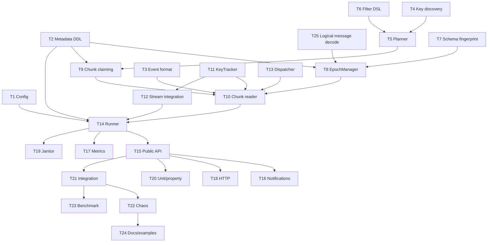

# Incremental Snapshots — Implementation Tasks

Companion to [INCREMENTAL_SNAPSHOT_DESIGN.md](INCREMENTAL_SNAPSHOT_DESIGN.md). Every task states its goal, the files it touches, the details that are easy to get wrong, its dependencies, and acceptance criteria that are checkable rather than aspirational.

**Conventions used below**

- `AC-n` items must all be true before a task is considered done.
- "Verified by" names the specific test that proves the AC, so no AC is left to reviewer judgement.
- Package `incremental` means `pq/snapshot/incremental`.

## Dependency graph



**Critical path:** T2 → T8 → T10 → T14 → T15 → T21. T11 and T12 are the correctness-critical pair and should be reviewed together by two people. T25 is small but blocks T8, so schedule it in stage 1.

---

## Epic A — Foundations

### T1 — Configuration surface

**Goal.** Add `IncrementalConfig` with defaults and validation, without disturbing the existing `SnapshotConfig`.

**Files.** [config/config.go](../config/config.go), [config/config_test.go](../config/config_test.go), [config/read.go](../config/read.go)

**Details.**

```go
type SnapshotConfig struct {
    // ... existing fields unchanged ...
    Incremental IncrementalConfig
}

type IncrementalConfig struct {
    Enabled             bool
    HTTPEnabled         bool          // default false
    MaxConcurrentRequests int         // default 1
    MaxQueuedRequests   int           // default 32
    MaxConcurrentChunks int           // default 4
    MaxConnections      int           // default 6; caps MaxConcurrentChunks
    ChunkSize           int64         // default: inherits SnapshotConfig.ChunkSize (8000)
    EpochChunkBudget    int           // default 256
    EpochMaxDuration    time.Duration // default 60s
    MaxTrackedKeys      int           // default 4_000_000
    OnTrackerOverflow   OverflowPolicy// default "degrade"
    OnSchemaChange      SchemaPolicy  // default "fail"
    DeliveryMode        DeliveryMode  // default "serialized"
    DispatchBufferSize  int           // default 4096
    ProgressInterval    time.Duration // default 5s
    StallThreshold      time.Duration // default 60s
    ShutdownGrace       time.Duration // default 10s
    ChunkLockTimeout    time.Duration // default 5s
    ChunkStatementTimeout time.Duration // default 120s
    FenceTimeout        time.Duration // default 10s; falls back to lsn_wait
    RequestRetention    time.Duration // default 168h
    MaxChunkAttempts    int           // default 5
}
```

Validation rules, each with its own error:

- `Enabled && Mode == SnapshotModeSnapshotOnly` → `ErrIncrementalRequiresStreaming` (design EC-14).
- `EpochMaxDuration` must be in `[5s, 15m]`.
- If PG's `old_snapshot_threshold` is non-zero, `EpochMaxDuration` must be strictly less than it. This is a **runtime** check at connector start (the GUC is not known at config-parse time), producing a startup error, not a silent misconfiguration.
- `MaxConcurrentChunks <= MaxConnections - 2` (metadata + epoch connections are reserved).
- `MaxTrackedKeys >= 10_000` — below that, degraded mode is effectively permanent and the operator almost certainly meant something else.
- `EpochChunkBudget >= MaxConcurrentChunks`, else workers idle at every epoch boundary.

**Dependencies.** None.

**AC.**
- AC-1 Defaults applied when zero, matching the table above. *Verified by* `TestIncrementalConfigDefaults`.
- AC-2 Each validation rule has a distinct sentinel error and a table-driven test case. *Verified by* `TestIncrementalConfigValidation`.
- AC-3 YAML round-trips through [config/read.go](../config/read.go) including durations. *Verified by* `TestReadIncrementalConfigYAML`.
- AC-4 Existing config tests pass unmodified.
- AC-5 `Enabled == false` leaves every existing code path byte-identical (no new goroutines, no new connections). *Verified by* a goroutine-count assertion in `TestIncrementalDisabledIsInert`.

---

### T2 — Metadata schema and bootstrap

**Goal.** Create the three new tables idempotently and race-free across instances.

**Files.** `incremental/schema.go`, `incremental/schema_test.go`

**Details.**

- DDL exactly as in design [D9.1](INCREMENTAL_SNAPSHOT_DESIGN.md#91-new-tables-additive-existing-tables-untouched).
- Bootstrap runs under `pg_advisory_xact_lock(hashString("cdc_incremental_schema"))` so concurrent instances cannot race `CREATE TABLE IF NOT EXISTS` into a `23505`/`42P07` (PostgreSQL's `IF NOT EXISTS` is *not* race-safe under concurrent DDL — this is a real failure mode, not a theoretical one).
- Bootstrap is lazy: invoked on first `Submit` or on runner start when non-terminal requests may exist, never at import time.
- A `schema_version` row lives in a small `cdc_incremental_meta(key, value)` table so future migrations are possible; v1 writes `version = 1`.
- All identifiers quoted via `pgx.Identifier{}.Sanitize()`.

**Dependencies.** None.

**AC.**
- AC-1 Running bootstrap 10× concurrently from 10 connections produces no error and one set of tables. *Verified by* `TestSchemaBootstrapConcurrent`.
- AC-2 All indexes from the design exist with the stated predicates. *Verified by* a `pg_indexes` assertion in `TestSchemaIndexes`.
- AC-3 `DROP` of all `cdc_incremental_*` tables followed by bootstrap restores a working system.
- AC-4 Existing `cdc_snapshot_job` / `cdc_snapshot_chunks` are untouched — asserted by comparing `pg_dump --schema-only` output before and after.

---

### T3 — Event format extension

**Goal.** Give `format.Snapshot` request identity without breaking existing consumers.

**Files.** [pq/message/format/snapshot.go](../pq/message/format/snapshot.go), [example/](../example)

**Details.**

- Add `RequestID string`, `EpochID int64`, `ChunkIndex int64`, `Metadata map[string]string`.
- Add `func (s *Snapshot) Decoded() map[string]any { return s.Data }` so handlers can use one accessor name across `format.Insert` and `format.Snapshot` (design GAP-6).
- **Do not** rename or remove any existing field.
- New fields are zero-valued for `initial` / `snapshot_only` snapshots, which is how consumers distinguish them.
- `Metadata` is shared (not copied) across events of one request — document that handlers must not mutate it. A copy per row would allocate on the hot path for no benefit.

**Dependencies.** None.

**AC.**
- AC-1 Existing `example/snapshot-initial-mode` compiles and behaves identically. *Verified by* `TestSnapshotInitialModeUnchanged`.
- AC-2 `go vet -composites` reports no unkeyed-literal breakage across the repo and examples.
- AC-3 `Decoded()` returns the same map identity as `.Data` (no copy). *Verified by* `TestSnapshotDecodedAlias`.

---

## Epic B — Planning

### T4 — Ordering key discovery

**Goal.** Determine, per table, the ordered key used for chunk boundaries — or reject the request with a precise reason.

**Files.** `incremental/keydef.go`, `incremental/keydef_test.go`

**Details.**

Resolution order (design [D6.1](INCREMENTAL_SNAPSHOT_DESIGN.md#61-chunking-strategy-keyset-pk-ranges-only)):

1. Declared `PRIMARY KEY` (single or composite) — from `pg_index.indisprimary`.
2. `REPLICA IDENTITY USING INDEX` columns — reuse [pq/publication/replica_identity.go](../pq/publication/replica_identity.go).
3. User-supplied `TableRequest.OrderBy`, validated to be `NOT NULL` and backed by a unique index (`pg_index.indisunique`). Without uniqueness, half-open boundary intervals can duplicate or skip rows at a boundary that has ties.

Capture for each key column: `attname`, `atttypid`, `attnum`, `collation oid`, and whether the index is usable for range scans (btree only — hash/GIN/GiST indexes cannot drive ordered range predicates).

Produce a `KeyDef`:

```go
type KeyDef struct {
    Columns   []KeyColumn // ordered
    Kind      KeyKind     // monotonic | random | unknown
    IndexName string
    Collation []uint32
}
```

`Kind` heuristics: `int2/4/8` with a sequence/identity default, or `uuid` where a sample of 1000 rows shows the UUID version nibble is 7 → `monotonic`. UUIDv4, `text`, and hash-distributed keys → `random`. This only affects optimisation (design [D6.3](INCREMENTAL_SNAPSHOT_DESIGN.md#63-the-snapshot-endpoint)), never correctness, so an incorrect classification must degrade gracefully.

**Errors.** `ErrNoOrderingKey`, `ErrNullableOrderingKey`, `ErrNonUniqueOrderingKey`, `ErrUnsupportedKeyIndex`.

**Dependencies.** None.

**AC.**
- AC-1 Resolves single-int, composite, `uuid`, and `text` PKs. *Verified by* `TestKeyDefResolution` (table-driven, real PG).
- AC-2 Falls through PK → replica-identity index → explicit `OrderBy` in that order. *Verified by* `TestKeyDefFallbackOrder`.
- AC-3 Rejects a table with no PK, no replica-identity index, and no `OrderBy` with `ErrNoOrderingKey` **at submission time**, not mid-run. *Verified by* `TestSubmitRejectsUnorderableTable`.
- AC-4 Rejects a non-unique `OrderBy` with `ErrNonUniqueOrderingKey`.
- AC-5 UUIDv7 classified `monotonic`, UUIDv4 `random`. *Verified by* `TestKeyKindClassification`.
- AC-6 Collation recorded and mismatches rejected (design EC-4).

---

### T5 — Chunk boundary planner

**Goal.** Partition the key domain into disjoint, exhaustive, half-open ranges persisted as typed JSONB boundaries.

**Files.** `incremental/planner.go`, `incremental/boundary.go`, `incremental/planner_test.go`

**Details.**

- Two methods (design [D6.2](INCREMENTAL_SNAPSHOT_DESIGN.md#62-composite-and-non-integer-keys)): arithmetic split for dense single-integer keys (reuse the existing `shouldFallbackSparseIntegerRange` heuristic to decide), percentile sampling otherwise:

```sql
SELECT percentile_disc($1::float8[]) WITHIN GROUP (ORDER BY (col1, col2))
  FROM ONLY schema.table TABLESAMPLE SYSTEM ($2)
 WHERE <filter>;
```

- Sample fraction chosen so the sample is ≈200k rows: `p = min(100, 200000 / reltuples * 100)`. On tiny tables `p = 100`.
- Capture `max_key` (the snapshot endpoint) **inside the planning transaction**, so it is consistent with the boundaries.
- Boundaries stored as JSONB arrays with a per-element type tag: `[{"t":"int8","v":"42"},{"t":"uuid","v":"018f..."}]`. Values are stored as **strings** to avoid JSON number precision loss on `int8` and `numeric` — a real bug source.
- First chunk has `key_lo = NULL` (unbounded below); last chunk has `key_hi = NULL` but is still bounded by `key <= max_key` in the query.
- Boundaries are also kept in memory as a sorted slice for the `KeyTracker`'s binary search (design [D7.3](INCREMENTAL_SNAPSHOT_DESIGN.md#73-pruning--what-makes-memory-bounded)).
- Selectivity probe: `EXPLAIN (FORMAT JSON)` the filtered query once; if estimated rows < 10% of the unfiltered estimate, re-plan boundaries over the filtered distribution.
- Chunks are inserted in **batches** (reuse the existing batch-insert approach from `coordinator.go`), because 12,500 single-row inserts is a measurable startup cost.

**Dependencies.** T4, T6.

**AC.**
- AC-1 **Partition property**: for any table and key type, the union of chunk ranges covers every key `≤ max_key`, and no key is in two ranges. *Verified by* a property test `TestBoundariesArePartition` over generated key sets including duplicates-at-boundary, single-row, and empty tables.
- AC-2 Composite keys produce row-value boundaries that PG can index-scan — the query plan for a chunk shows `Index Scan`/`Index Only Scan`, not `Seq Scan`. *Verified by* `TestChunkQueryUsesIndex` asserting on `EXPLAIN` output.
- AC-3 `int8` boundaries near `math.MaxInt64` round-trip exactly through JSONB. *Verified by* `TestBoundaryPrecision`.
- AC-4 Empty table → zero chunks; single row → one chunk. *Verified by* `TestPlannerEdgeSizes`.
- AC-5 Zipf-skewed key distribution produces chunks whose row counts are within 4× of the mean. *Verified by* `TestPlannerSkewedDistribution` — this is the design's open question 2 and must be answered here.
- AC-6 100M-row plan (12,500 chunks) is written in < 5s. *Verified by* `BenchmarkPlanLargeTable`.

---

### T6 — Filter DSL and compiler

**Goal.** Compile the four filter kinds into one safe, parameterised predicate.

**Files.** `incremental/filter.go`, `incremental/filter_test.go`

**Details.**

- Types exactly as design [D6.4](INCREMENTAL_SNAPSHOT_DESIGN.md#64-the-filter-dsl).
- Compilation output is `(sqlFragment string, args []any)` — **never** a fully interpolated string. The only component permitted to contribute raw SQL text is `Predicate`, and only after validation.
- `Predicate` validation reuses [pq/publication/query_condition.go](../pq/publication/query_condition.go), **plus** a submission-time `EXPLAIN` against the real table so a typo fails in `Submit` rather than on chunk 9,000.
- `ColumnValues` map iteration is randomised in Go — sort keys so the generated SQL is deterministic and cacheable.
- `Shard` compiles to `hashtextextended(col::text, 0) % $n = ANY($m)`. Use `hashtextextended`, not `hashtext`: the latter's return width and value differ across builds.
- `ChangedSince` checks the column's type is `timestamp`/`timestamptz`/`date` and warns (metric, not error) if no index covers it.
- Column names validated against `information_schema.columns` and quoted with `pgx.Identifier{}.Sanitize()`.

**Dependencies.** None.

**AC.**
- AC-1 A fuzz corpus of injection attempts (`'; DROP TABLE`, `--`, `/*`, `$$`, unicode homoglyph quotes, nested comments) is rejected or safely parameterised. *Verified by* `FuzzFilterCompile`.
- AC-2 No compiled filter ever contains a user-supplied *value* as SQL text. *Verified by* `TestFilterValuesAreParameterised`, which asserts `pg_stat_statements` shows `$1`-style placeholders for a request with a string value containing a quote.
- AC-3 Identical filters compile to byte-identical SQL regardless of map ordering. *Verified by* `TestFilterCompilationDeterministic` (run 100×).
- AC-4 A syntactically invalid `Predicate` fails in `Submit` with the PG error text attached. *Verified by* `TestSubmitRejectsInvalidPredicate`.
- AC-5 Shard filter output set exactly equals `SELECT ... WHERE hashtextextended(id::text,0) % 16 = 7` run directly. *Verified by* `TestIncremental_FilterShard`.

---

### T7 — Schema fingerprinting and change policy

**Goal.** Detect schema drift cheaply and apply a declared policy.

**Files.** `incremental/schema_fingerprint.go`, `incremental/schema_policy.go`, tests

**Details.**

- Fingerprint query and hash exactly as design [D12.2](INCREMENTAL_SNAPSHOT_DESIGN.md#122-schema-fingerprinting). PK columns fingerprinted **separately** so a PK change is distinguishable from a payload change.
- Checked at **epoch open**, not per chunk — one catalog query per epoch.
- Classifier maps an old/new fingerprint pair to `Additive | Destructive | PKChange | ReplicaIdentityChange`, driving the policy table in design [D12.3](INCREMENTAL_SNAPSHOT_DESIGN.md#123-policies).
- Add `isSchemaDriftError(err)` recognising `42703` (undefined column) and `42804` (datatype mismatch), so those abort the epoch and trigger a fingerprint re-check instead of failing the request outright (design [D12.5](INCREMENTAL_SNAPSHOT_DESIGN.md#125-interaction-with-the-set-transaction-snapshot--ddl-boundary)).
- Column list is always resolved from the live catalog, intersected with the publication column list; **`SELECT *` is never generated** for incremental requests (design [D12.4](INCREMENTAL_SNAPSHOT_DESIGN.md#124-column-list-resolution)).

**Dependencies.** None.

**AC.**
- AC-1 Every row of the design's change-classification table has a test case. *Verified by* `TestSchemaChangeClassification`.
- AC-2 **Any** PK column change fails under all three policies. *Verified by* `TestIncremental_SchemaPKChange`.
- AC-3 `adapt` on an added nullable column continues and later rows contain the column. *Verified by* `TestIncremental_SchemaAddColumn_Adapt`.
- AC-4 `replan` retains completed chunks and re-plans only the remainder. *Verified by* `TestIncremental_SchemaDropColumn_Replan` asserting `completed_chunks` does not regress.
- AC-5 Fingerprint check costs one query per epoch. *Verified by* a `pg_stat_statements` call-count assertion in `TestFingerprintQueryCount`.

---

## Epic C — Execution

### T8 — EpochManager

**Goal.** Own the exported-snapshot lifecycle with per-epoch isolation.

**Files.** `incremental/epoch.go`, `incremental/epoch_test.go`

**Details.**

- `Open(ctx, requestID) (*Epoch, error)`: dedicated connection → `SET lock_timeout`/`statement_timeout` → `BEGIN TRANSACTION ISOLATION LEVEL REPEATABLE READ` → `pg_current_wal_lsn()` → `pg_export_snapshot()` → `INSERT` epoch row (`state='open'`) → start keepalive goroutine.
- **`AwaitFence(ctx, ep)` is what makes suppression exact** (design [D5.6](INCREMENTAL_SNAPSHOT_DESIGN.md#56-the-epoch-fence--why-atomic-capture-is-not-enough)). After `Open`, emit `pg_logical_emit_message(false, 'gopqcdc_epoch', <epoch_id>)` on a **separate** connection (the epoch connection is inside a `REPEATABLE READ` transaction; a non-transactional message from it would still be written immediately, but using a separate connection keeps the epoch transaction read-only and avoids assigning it an xid). Record the returned LSN as `fence_lsn`, then block until the stream goroutine reports having decoded that exact epoch id.
- The fence handshake is a registration, not a poll: `EpochManager` registers `epoch_id -> chan struct{}` with the stream hook before emitting; the stream closes the channel when it decodes the matching message. This gives a real happens-before with the `KeyTracker` marks, not an LSN comparison.
- **Fallback** (`fence_mode = 'lsn_wait'`): if proto version < 2, or the fence is not observed within `FenceTimeout`, wait until the stream's received LSN exceeds `fence_lsn` instead. Correct but slower on an idle database. Record the mode on the epoch row and increment a metric so the weaker path is visible rather than silent.
- Ordering of `pg_current_wal_lsn()` before `pg_export_snapshot()` is retained as defence in depth, but is **no longer load-bearing** once the fence is in place. Keep the code comment explaining why, since the reversed order looks harmless and a future reader will be tempted to "simplify" it into one statement — which, as design D5.6 shows, does not fix the underlying commit-visibility window.
- Each `Epoch` owns its own connection, keepalive `context.CancelFunc`, fence channel, and `done` channel — no shared `Snapshotter` fields (design GAP-9).
- `Close(ctx, ep)`: cancel keepalive, `COMMIT`, `UPDATE ... state='closed'`, release the connection.
- `Abort(ctx, ep, reason)`: `ROLLBACK`, `state='aborted'`, reset all `in_progress` chunks with this `epoch_id` to `pending` with `epoch_id = NULL`.
- Keepalive: `SELECT 1` every 30s on the epoch connection, matching the existing pattern.
- Epoch connection sets `idle_in_transaction_session_timeout = 0` (it is legitimately idle while workers read) but the **chunk** connections do not (design [D13.3](INCREMENTAL_SNAPSHOT_DESIGN.md#133-backpressure-and-rate-limiting)).

**Dependencies.** T2, T7, T25.

**AC.**
- AC-1 No chunk of an epoch is read before that epoch's fence is observed. *Verified by* `TestEpochFenceBlocksChunks`, which stalls the fence and asserts zero chunk claims.
- AC-2 **The commit-visibility hazard is closed.** With a writer committing continuously and an artificially widened commit window (`fsync` stall injected via a slow disk or `pg_sleep` in a commit trigger), no snapshot row is emitted whose key was modified by a transaction with `commit_lsn <= snapshot_lsn`. *Verified by* `TestEpochFenceClosesVisibilityWindow`, which fails if the fence is disabled — the test must be shown to fail without the fence, otherwise it proves nothing.
- AC-3 Killing the epoch backend causes workers to observe `22023` and the epoch to transition to `aborted` with all its chunks re-pended. *Verified by* `TestChaos_EpochCoordinatorKilled`.
- AC-4 `backend_xmin` advances between epochs. *Verified by* `TestIncremental_XminAdvances`.
- AC-5 Two concurrent epochs for different requests do not share connection or fence state. *Verified by* `TestEpochIsolation`.
- AC-6 No epoch transaction exceeds `EpochMaxDuration + 5s` under any test, fence wait included. *Verified by* an assertion in the chaos suite's teardown.
- AC-7 The `lsn_wait` fallback produces the same correctness outcome as the message fence. *Verified by* running `TestEpochFenceClosesVisibilityWindow` parameterised over both `fence_mode` values.
- AC-8 Fence overhead is under 50 ms per epoch at p99 on a non-idle database. *Verified by* `BenchmarkEpochFence`.

---

### T9 — Chunk claiming, heartbeat and reclaim

**Goal.** Exactly-once claiming across instances, with liveness.

**Files.** `incremental/claim.go`, `incremental/heartbeat.go`, tests

**Details.**

- Claim CTE exactly as design [D9.2](INCREMENTAL_SNAPSHOT_DESIGN.md#92-multi-instance-coordination), scoped by `request_id`, ordered by `chunk_index`, `FOR UPDATE SKIP LOCKED`.
- All timestamps evaluated as PG `now()`, never Go `time.Now()` (design EC-15).
- Heartbeat goroutine per request executor updates `heartbeat_at` for all chunks currently held by this instance in **one** statement (`WHERE id = ANY($1)`), not one per chunk.
- Reclaim threshold is `ClaimTimeout` (inherited from the existing `SnapshotConfig`, default 30s), and must be > `2 × HeartbeatInterval` — validated at config time.
- `attempt` increments on claim; a chunk reaching `MaxChunkAttempts` transitions to `failed_chunk` and fails the request (design [D10.3](INCREMENTAL_SNAPSHOT_DESIGN.md#103-chunk-state-machine)). Silent skipping is forbidden.

**Dependencies.** T2, T5.

**AC.**
- AC-1 With 8 concurrent claimers and 1000 chunks, every chunk is claimed exactly once and none is skipped. *Verified by* `TestClaimExactlyOnce`.
- AC-2 A claimer that stops heartbeating has its chunk reclaimed after `ClaimTimeout` and not before. *Verified by* `TestClaimReclaimTiming`.
- AC-3 Heartbeat for N held chunks issues one statement. *Verified by* `pg_stat_statements` assertion in `TestHeartbeatBatched`.
- AC-4 `MaxChunkAttempts` exhaustion fails the request with the chunk's `last_error` attached. *Verified by* `TestChunkAttemptExhaustion`.

---

### T10 — Chunk reader

**Goal.** Stream rows out of a chunk with bounded memory, correct stamping, and suppression.

**Files.** `incremental/chunk_reader.go`, tests

**Details.**

- `BEGIN TRANSACTION ISOLATION LEVEL REPEATABLE READ` → `SET TRANSACTION SNAPSHOT '<epoch.snapshot_id>'` → the chunk query.
- Query built from: resolved column list (T7), typed boundary predicates (T5), compiled filter (T6), `ORDER BY <key columns>`, and `key <= max_key`.
- **Row-at-a-time streaming** via `pgconn.ResultReader`. `ReadAll()` is forbidden and should be caught by a lint rule or a review checklist item (design [D13.2](INCREMENTAL_SNAPSHOT_DESIGN.md#132-where-the-memory-goes)).
- Decode via the existing `DecoderCache` and `pgtype.TextFormatCode`, so decoded Go types match the streaming path exactly (this is why no new consumer decoder is needed).
- For each row: extract the PK tuple → `keyTracker.EmitUnlessTouched(relOID, pk, emit)` → `emit` builds `format.Snapshot{EventType: DATA, LSN: epoch.snapshot_lsn, RequestID, EpochID, ChunkIndex}` and hands it to the dispatcher.
- Rate limiting: token bucket checked every 256 rows.
- `map[string]any` for row data comes from a `sync.Pool` when `DeliveryMode == serialized` (the dispatcher returns it after the handler call); no pooling in `concurrent` mode, since lifetime is not controllable.
- On success: `COMMIT`, then `UPDATE chunk SET state='completed', rows_processed=$n, completed_at=now()`. On failure: `ROLLBACK`, chunk → `pending`, `last_error` recorded.

**Dependencies.** T3, T8, T9, T11, T13.

**AC.**
- AC-1 Peak heap during a 1M-row chunk read stays within 2× of the empty-chunk baseline. *Verified by* `TestChunkReaderMemoryProfile` using `runtime.MemStats` deltas.
- AC-2 Every emitted row carries its epoch's `snapshot_lsn`. *Verified by* `TestIncremental_EpochRollover`.
- AC-3 Decoded types for every PG type in the existing test matrix are identical to the streaming path's. *Verified by* `TestDecodeParityStreamVsSnapshot` — a direct value comparison, not a type-name comparison.
- AC-4 A chunk failing mid-read leaves no partial `completed` state and is retried. *Verified by* `TestChaos_ChunkConnKilled`.
- AC-5 `MaxRowsPerSecond` is honoured within 10%. *Verified by* `TestChunkReaderRateLimit`.
- AC-6 No `ReadAll` call exists in the package. *Verified by* a `grep`-based test `TestNoReadAllInIncremental`.

---

### T11 — KeyTracker

**Goal.** Bounded-memory membership tracking with the atomicity the correctness argument requires.

**Files.** `incremental/keytracker.go`, `incremental/keytracker_test.go`

**Details.**

- Structure and both paths exactly as design [D7.1](INCREMENTAL_SNAPSHOT_DESIGN.md#71-the-structure)–[D7.2](INCREMENTAL_SNAPSHOT_DESIGN.md#72-the-two-paths).
- 256 shards; shard index from the top bits of the fingerprint, not `% 256` on the low bits (low bits of xxhash are fine, but using a distinct bit range avoids correlating shard choice with map bucket choice).
- Entry value is the chunk index (`uint32`) for pruning, so the map is `map[uint64]uint32` — 24 B amortised.
- `Mark` computes the chunk index by binary search over the in-memory boundary slice.
- `EmitUnlessTouched` holds the shard lock across check-and-emit. **`emit` must never call back into the tracker** — enforced by a `//go:norace`-style comment plus a test that would deadlock if violated.
- `PruneBelow(watermark uint32)` walks shards and deletes entries below the watermark; runs between epochs, never during one.
- Watermark is the **contiguous completed prefix**, computed from an interval set to handle out-of-order chunk completion.
- Overflow policies (`degrade` / `fail` / `throttle`) as design [D7.4](INCREMENTAL_SNAPSHOT_DESIGN.md#74-degraded-mode--the-memory-hard-cap). On `degrade`, shard maps are set to `nil` so memory is returned to the heap immediately.
- `tracker.watermark_lsn` field and the gap rule from design [D11.5](INCREMENTAL_SNAPSHOT_DESIGN.md#115-the-one-genuinely-subtle-case-tracker-gaps).

**Dependencies.** T5 (boundary slice).

**AC.**
- AC-1 **Suppression never loses a key**: property test generating interleaved mark/check sequences asserts that a key is suppressed only if it was marked. *Verified by* `TestKeyTrackerNeverLosesKeys`.
- AC-2 Check-and-emit is atomic: a concurrent `Mark` cannot interleave between them. *Verified by* `TestKeyTrackerAtomicCheckEmit` under `-race` with 10k iterations.
- AC-3 `PruneBelow` reduces `size` correctly and never removes an entry at or above the watermark. *Verified by* `TestKeyTrackerPrune`.
- AC-4 Memory per entry ≤ 32 B including map overhead at 1M entries. *Verified by* `BenchmarkKeyTrackerMemory` asserting on `MemStats.HeapAlloc` delta.
- AC-5 Each overflow policy behaves as specified. *Verified by* the three `TestIncremental_TrackerOverflow_*` tests.
- AC-6 `Mark` costs < 100 ns with a request active and < 5 ns with none active. *Verified by* `BenchmarkKeyTrackerMark`.
- AC-7 Fingerprint collisions are handled: an artificially collided fingerprint suppresses at most one redundant read and never drops a key the stream did not cover. *Verified by* `TestKeyTrackerCollisionSafety` with an injected hash function.

---

### T12 — Streaming hot-path integration

**Goal.** Mark keys before emitting, with near-zero idle cost, and handle stream gaps.

**Files.** [pq/replication/stream.go](../pq/replication/stream.go), `incremental/stream_hook.go`

**Details.**

- In the message dispatch path, for `Insert`/`Update`/`Delete`:

```go
// MUST precede dispatch: reversing these reopens the delete-resurrection
// window described in INCREMENTAL_SNAPSHOT_DESIGN.md D5.4 C4.
keyTracker.Mark(relOID, pkBytes)
dispatcher.Emit(msg)
```

- PK bytes are extracted from the tuple using the relation cache's key columns. For `REPLICA IDENTITY DEFAULT`, `DELETE`/`UPDATE` old-tuples carry only key columns — which is exactly what is needed. For `REPLICA IDENTITY FULL`, the key columns are selected from the full tuple. For `NOTHING`, no key is available → design EC-11 applies.
- The extraction must be **allocation-free** in the common case: encode key columns into a reusable `[]byte` scratch buffer owned by the stream goroutine, hash it, discard. Never build a `map[string]any` for tracking.
- Gap handling: on stream (re)connect, set `tracker.watermark_lsn` to the resume LSN and clear the tracker; the runner then aborts any open epoch whose `snapshot_lsn < watermark_lsn` (design [D11.5](INCREMENTAL_SNAPSHOT_DESIGN.md#115-the-one-genuinely-subtle-case-tracker-gaps)).

**Dependencies.** T11.

**AC.**
- AC-1 With no active request, per-event overhead is a single atomic load and zero allocations. *Verified by* `BenchmarkStreamHotPathIdle` asserting `AllocsPerOp == 0` and comparing ns/op against the pre-change baseline (≤ 2% regression).
- AC-2 With an active request, key extraction allocates zero per event. *Verified by* `BenchmarkStreamHotPathActive`.
- AC-3 Mark strictly precedes emit. *Verified by* `TestMarkBeforeEmitOrdering` using an instrumented tracker and dispatcher recording a global sequence.
- AC-4 A stream disconnect advances the watermark and aborts stale epochs. *Verified by* `TestChaos_StreamDisconnect`.
- AC-5 `REPLICA IDENTITY FULL` and `USING INDEX` both yield correct key bytes. *Verified by* `TestKeyExtractionByReplicaIdentity`.

---

### T13 — Dispatcher

**Goal.** One delivery path for stream and snapshot events, with stream priority.

**Files.** `incremental/dispatcher.go`, tests

**Details.**

- Two channels: `hi` (stream, size `DispatchBufferSize`) and `lo` (snapshot, size `DispatchBufferSize`). One goroutine drains `hi` fully before taking from `lo`:

```go
for {
    select {
    case ev := <-hi:
        deliver(ev)
        continue
    default:
    }
    select {
    case ev := <-hi:
        deliver(ev)
    case ev := <-lo:
        deliver(ev)
    case <-ctx.Done():
        return
    }
}
```

- `DeliveryConcurrent` mode bypasses the dispatcher entirely; the stream goroutine and chunk workers call the handler directly. Document that the handler must then be thread-safe.
- `deliver` recovers panics, attaches `request_id`/`chunk_index` context, and returns the error to the caller so a chunk can fail (design FM-18).
- Row `map[string]any` returned to the `sync.Pool` after `deliver` in serialized mode.
- Queue depth exported as a metric per priority.

**Dependencies.** None.

**AC.**
- AC-1 A saturated `lo` queue never delays `hi` delivery beyond one event. *Verified by* `TestDispatcherStreamPriority`, measuring `hi` latency with `lo` full.
- AC-2 Handler panic is recovered and surfaces as a chunk error, not a process crash. *Verified by* `TestChaos_HandlerPanic`.
- AC-3 Serialized mode never invokes the handler concurrently. *Verified by* `TestDispatcherSerialization` with a concurrency-detecting handler under `-race`.
- AC-4 Pooled row maps are not retained after `deliver` returns. *Verified by* `TestDispatcherPoolSafety` (poisons the map after return and asserts no reuse corruption).

---

### T14 — RequestRegistry and runner

**Goal.** Durable request lifecycle, resumption, and the epoch loop.

**Files.** `incremental/registry.go`, `incremental/runner.go`, tests

**Details.**

- `runRequest` / `runEpoch` per design [D5.3](INCREMENTAL_SNAPSHOT_DESIGN.md#53-pseudocode).
- All state transitions are conditional updates (`WHERE id=$1 AND state=$2`); zero rows affected means another instance won — re-read and re-evaluate, never force.
- On connector start: load all non-terminal requests for the slot, abort their open epochs, reset stale `in_progress` chunks, and resume. Requests are started only after `WaitUntilReady` (design EC-13).
- Adaptive epoch sizing (design [D13.3](INCREMENTAL_SNAPSHOT_DESIGN.md#133-backpressure-and-rate-limiting)): if p95 chunk latency × `EpochChunkBudget` > `EpochMaxDuration`, reduce the budget for the next epoch.
- Queueing: at most `MaxConcurrentRequests` running, ordered by `priority DESC, created_at`; the rest stay `pending`.
- Completion: set `completed_lsn = pg_current_wal_lsn()`, `state='completed'`, deactivate the tracker, emit `END` markers per table and `NotifyCompleted`.
- Graceful shutdown: stop claiming, wait `ShutdownGrace` for in-flight chunks, re-pend the rest, close epochs, then return — reusing the existing SIGTERM LSN-flush ordering so the slot's `confirmed_flush_lsn` is not regressed.

**Dependencies.** T1, T2, T8, T9, T10, T12, T13.

**AC.**
- AC-1 SIGKILL at any of 20 injected points resumes correctly with the oracle contract intact. *Verified by* `TestChaos_ConnectorRestart` (parameterised over injection points).
- AC-2 Graceful shutdown produces zero duplicate rows when the sink is fast. *Verified by* `TestChaos_ConnectorGracefulRestart`.
- AC-3 Concurrent state transitions from two instances never produce a double transition. *Verified by* `TestRegistryTransitionRaces`.
- AC-4 Adaptive sizing converges: with artificially slow chunks, epochs close on budget rather than always timing out. *Verified by* `TestAdaptiveEpochBudget`.
- AC-5 Queued requests start in priority order. *Verified by* `TestRequestQueueOrdering`.
- AC-6 A completed request leaves no `open` epochs and no `in_progress` chunks. *Verified by* a post-condition assertion helper used by every integration test.

---

## Epic D — API and operations

### T15 — Public Go API

**Goal.** The control surface from design [D8](INCREMENTAL_SNAPSHOT_DESIGN.md#d8--public-driver-api).

**Files.** `incremental/api.go`, `incremental/request.go`, [connector.go](../connector.go)

**Details.**

- Add `IncrementalSnapshots() incremental.API` to the `Connector` interface. This is a **breaking change for anyone implementing `Connector`**; the repo's own `newSnapshotOnlyConnector` must return an implementation that fails with `ErrIncrementalRequiresStreaming`. Note it in the changelog.
- `Submit` validates → resolves key defs and filters (so bad requests fail here, not mid-run) → persists → returns a `Handle`.
- Idempotency via the partial unique index; on conflict, load and return the existing request rather than erroring.
- `Handle.Done()` closes on terminal state; `Handle.Status()` returns a cached snapshot updated by the runner (no DB round-trip); `Handle.Err()` valid after `Done()`.
- `Pause`/`Resume`/`Cancel` are conditional updates; `Cancel` also aborts open epochs and releases chunks.
- Sentinel errors: `ErrIncrementalDisabled`, `ErrIncrementalRequiresStreaming`, `ErrTooManyRequests`, `ErrNoOrderingKey`, `ErrNullableOrderingKey`, `ErrNonUniqueOrderingKey`, `ErrNoReplicaIdentity`, `ErrSchemaChanged`, `ErrTrackerOverflow`, `ErrSlotInvalidated`, `ErrRequestNotFound`.

**Dependencies.** T14.

**AC.**
- AC-1 Five concurrent `Submit` calls with the same idempotency key create exactly one request and return equivalent handles. *Verified by* `TestIncremental_Idempotency`.
- AC-2 Every sentinel error is reachable and covered by a test. *Verified by* `TestIncrementalSentinelErrors`.
- AC-3 `Submit` on a request with an invalid filter or unorderable table returns before persisting anything. *Verified by* asserting zero rows in `cdc_incremental_request` after a failed submit.
- AC-4 `Cancel` mid-run reaches terminal state within `ShutdownGrace` and releases all chunks. *Verified by* `TestIncremental_Cancel`.
- AC-5 API is unusable and returns `ErrIncrementalDisabled` when the feature is off. *Verified by* `TestIncrementalDisabledIsInert`.

---

### T16 — Notifications

**Goal.** Async, non-blocking lifecycle notification with three delivery shapes.

**Files.** `incremental/notify.go`, tests

**Details.**

- One dispatcher goroutine, bounded queue (128).
- `NotifyProgress` is coalesced: only the latest is retained if the queue is backed up, and it is rate-limited to `ProgressInterval`.
- Lifecycle notifications (`Started`, `Completed`, `Failed`, `Cancelled`, `Degraded`) are **never dropped**; the dispatcher blocks and raises a slow-listener metric after 1s.
- `Request.OnComplete` is invoked exactly once, guarded by `sync.Once`, from this goroutine — never from the WAL receiver or a chunk worker.
- Listener panics are recovered and logged; one bad listener cannot take down the connector or block others.

**Dependencies.** T15.

**AC.**
- AC-1 `OnComplete` fires exactly once even when the request fails, is cancelled, or the process handles concurrent terminal transitions. *Verified by* `TestNotifyOnCompleteOnce`.
- AC-2 A listener sleeping 10s does not block the runner or the stream. *Verified by* `TestNotifySlowListener` asserting replication lag is unaffected.
- AC-3 Progress notifications are rate-limited to `ProgressInterval` and always include a final 100% notification. *Verified by* `TestNotifyProgressThrottle`.
- AC-4 A panicking listener is isolated. *Verified by* `TestNotifyListenerPanic`.

---

### T17 — Metrics and dashboard

**Goal.** The metric set from design [D14.1](INCREMENTAL_SNAPSHOT_DESIGN.md#141-metrics).

**Files.** [internal/metric/metric.go](../internal/metric/metric.go), [internal/metric/registry.go](../internal/metric/registry.go), [grafana/dashboard.json](../grafana/dashboard.json)

**Details.**

- Follow the existing `Metric` interface style; add methods rather than exposing Prometheus types to callers.
- **Cardinality guard:** `request_id` is a label, and requests accumulate over time. Metrics for terminal requests are unregistered when the request leaves the active set (retaining only counters aggregated without `request_id`). Unbounded label growth is the standard way a metrics change becomes an outage.
- Histogram buckets for `chunk_duration_seconds`: `{.005,.01,.025,.05,.1,.25,.5,1,2.5,5,10,30}` — chosen to straddle the 15–60 ms expectation from design [D13.1](INCREMENTAL_SNAPSHOT_DESIGN.md#131-throughput-model).
- Dashboard panels: progress, rows/sec, suppression ratio, chunk-duration heatmap, epoch outcomes, tracked keys vs cap, dispatch queue depth, and replication lag overlaid with snapshot activity (the panel operators will actually look at).
- Three recommended alert rules shipped as a `grafana/alerts.yaml` or documented in the README.

**Dependencies.** T14.

**AC.**
- AC-1 Metric cardinality stays bounded when 1000 requests complete over a run. *Verified by* `TestMetricCardinalityBounded` asserting on `prometheus.Gatherer` output size.
- AC-2 Every metric in the design table exists with the stated type and labels. *Verified by* `TestIncrementalMetricsPresent`.
- AC-3 Dashboard JSON is valid and every panel's query references an existing metric. *Verified by* `TestDashboardQueriesResolve`.

---

### T18 — HTTP control endpoints

**Goal.** Optional REST surface.

**Files.** [internal/http/server.go](../internal/http/server.go), `incremental/http.go`

**Details.**

- Routes per design [D8.7](INCREMENTAL_SNAPSHOT_DESIGN.md#87-http-control-surface); registered only when `HTTPEnabled`.
- Request body size capped (64 KiB) and JSON decoding uses `DisallowUnknownFields` so a typo in a filter key is an error, not a silently ignored field.
- `POST` is idempotent via the same `IdempotencyKey`, returning `200` with the existing status rather than `201` when a request already exists.
- Errors map to status codes: validation → `400`, not found → `404`, too many → `429`, disabled → `404` (route absent).
- Documented as requiring network-level protection, consistent with the existing unauthenticated `/metrics` and `/slot`.

**Dependencies.** T15.

**AC.**
- AC-1 Routes absent (404) when `HTTPEnabled` is false. *Verified by* `TestIncrementalHTTPDisabled`.
- AC-2 Unknown JSON fields are rejected with a message naming the field. *Verified by* `TestIncrementalHTTPStrictDecode`.
- AC-3 Oversized bodies are rejected without buffering. *Verified by* `TestIncrementalHTTPBodyLimit`.
- AC-4 Full lifecycle (create → poll → pause → resume → cancel) works over HTTP. *Verified by* `TestIncrementalHTTPLifecycle`.

---

### T19 — Janitor and retention

**Goal.** Bounded metadata growth and recovery from orphaned state.

**Files.** `incremental/janitor.go`, tests

**Details.**

- Runs on the coordinator instance only, every `RetentionInterval` (default 1h).
- Deletes terminal requests older than `RequestRetention`; `ON DELETE CASCADE` handles epochs and chunks.
- Aborts epochs left `open` whose coordinator has not heartbeated within `ClaimTimeout` — the cleanup path for a coordinator that died between `Open` and `Abort`.
- Deletes rows whose `slot_name` is absent from `pg_replication_slots` (slot was dropped and recreated).
- Deletes in batches (`LIMIT 1000`) so a large cleanup does not hold long locks.

**Dependencies.** T14.

**AC.**
- AC-1 Terminal requests older than retention are removed with their epochs and chunks. *Verified by* `TestJanitorRetention`.
- AC-2 An orphaned `open` epoch is aborted and its chunks re-pended. *Verified by* `TestJanitorOrphanedEpoch`.
- AC-3 Janitor never deletes a non-terminal request. *Verified by* `TestJanitorPreservesActive`.
- AC-4 A 1M-row cleanup does not block chunk claiming for more than 100 ms. *Verified by* `TestJanitorBatching`.

---

## Epic E — Quality

### T20 — Unit and property tests

**Goal.** Cover the logic that integration tests cannot isolate.

**Files.** `incremental/*_test.go`

**Details.** Property tests are the important part here, since the failure modes are combinatorial:

- Boundary partition property (T5 AC-1).
- `KeyTracker` never-loses-keys property (T11 AC-1).
- `hashtextextended` Go↔PG parity over 100k random strings including unicode, empty, and 1 MiB values — **design open question 1**. If parity cannot be achieved robustly, implement the documented fallback (over-approximate by marking all keys for the table) and record the decision here.
- Filter compilation fuzz (T6 AC-1).
- State-machine model test: a randomised sequence of events applied to the request/epoch/chunk state machines never reaches an invalid state.

**Dependencies.** T15.

**AC.**
- AC-1 Package coverage ≥ 85% statements for `incremental`.
- AC-2 All property tests run ≥ 1000 iterations in CI and are seeded reproducibly.
- AC-3 `go test -race ./...` is clean.
- AC-4 The `hashtextextended` parity question is resolved with a documented outcome, either parity or the fallback.

---

### T21 — Integration tests

**Goal.** The matrix from design [D15.3](INCREMENTAL_SNAPSHOT_DESIGN.md#153-integration-test-matrix), against real PostgreSQL.

**Files.** `integration_test/incremental_*_test.go`, `integration_test/incremental_helpers_test.go`, `integration_test/oracle_test.go`

**Details.**

- Follow existing conventions in [integration_test/main_test.go](../integration_test/main_test.go) (testcontainers, shared container, `SetupTestDB`/`RestoreDB`).
- **Build the `Oracle` first** (design [D15.2](INCREMENTAL_SNAPSHOT_DESIGN.md#152-the-correctness-oracle)). Every contract test asserts through it; no test hand-rolls contract assertions.
- Concurrent-writer harness: a goroutine issuing a configurable mix of insert/update/delete at a target rate, so tests exercise the interesting interleavings rather than a quiet table.
- Determinism: tests that depend on timing (reclaim, epoch rollover) use shortened configured durations rather than sleeps tuned to a machine.

**Dependencies.** T15.

**AC.**
- AC-1 Every row of the design's integration matrix has a test with the stated assertion.
- AC-2 `TestIncremental_DeleteDuringSnapshot` passes 100 consecutive runs — this is the no-resurrection guarantee and flakiness here is a correctness signal, not a test-quality signal.
- AC-3 `TestIncremental_StreamingUnaffected` demonstrates p99 replication-lag increase < 5% (goal G1).
- AC-4 The full suite runs in CI in under 20 minutes.
- AC-5 Existing integration tests pass unmodified (goal G8).

---

### T22 — Chaos tests

**Goal.** The matrix from design [D15.4](INCREMENTAL_SNAPSHOT_DESIGN.md#154-chaos-matrix-each-asserts-the-oracle-contract).

**Files.** `integration_test/incremental_chaos_test.go`

**Details.**

- Fault injection primitives: `pg_terminate_backend` for targeted connection kills, container restart for PG failure, `SIGKILL`/`SIGTERM` for the connector, and toxiproxy for partitions and latency.
- Each test runs with a concurrent writer and asserts through the `Oracle`.
- `TestChaos_ConnectorRestart` is parameterised over injection points (during planning, mid-chunk, between epochs, during completion) rather than a single point.
- Every chaos test asserts the post-condition helper from T14 AC-6 after recovery.

**Dependencies.** T21.

**AC.**
- AC-1 Every row of the design's chaos matrix has a test.
- AC-2 All chaos tests assert the full oracle contract, not just "no error".
- AC-3 Duplicate counts stay within the documented bound (≤ one chunk per injected fault). *Verified by* the oracle's duplicate budget check.
- AC-4 No test leaves an orphaned epoch, an open transaction, or a leaked connection. *Verified by* a teardown assertion on `pg_stat_activity`.

---

### T23 — Scale benchmark

**Goal.** Validate — or correct — the performance targets in design [D13.1](INCREMENTAL_SNAPSHOT_DESIGN.md#131-throughput-model).

**Files.** `benchmark/benchmark_incremental/` (docker-compose, prometheus.yml, grafana/, sql/, README.md)

**Details.**

- Mirror the layout of `benchmark/benchmark_initial/`.
- Seed 100M rows with a realistic row width and a mix of monotonic and random key tables.
- Scenarios per design [D15.5](INCREMENTAL_SNAPSHOT_DESIGN.md#155-scale-benchmark).
- Record results in the README as measured numbers with the hardware described. **If the 150k rows/sec target is not met, update the design's target rather than the benchmark** — the design states it as a target to validate, not a claim.

**Dependencies.** T21.

**AC.**
- AC-1 All five scenarios run reproducibly from `make benchmark-incremental`.
- AC-2 Memory ceiling scenario confirms goal G4 (< 200 MiB RSS attributable, tracked keys under cap).
- AC-3 Vacuum-health scenario confirms goal G6 (`backend_xmin` advances at least once per `EpochMaxDuration`).
- AC-4 Measured throughput recorded in the README; design updated if it differs from the target by more than 30%.
- AC-5 Sharded scenario shows ≥ 3× speedup with 4 instances.

---

### T24 — Documentation and examples

**Goal.** Make the feature usable without reading the design doc.

**Files.** [README.md](../README.md), `docs/INCREMENTAL_SNAPSHOT.md` (user-facing), `example/incremental-snapshot-basic/`, `example/incremental-snapshot-filtered/`, `example/incremental-snapshot-sharded/`

**Details.**

- The user-facing doc is distinct from the design doc: configuration, the API, the four filter kinds, what the delivery contract guarantees, and the **sink-side LSN rule** (`if stored_lsn >= incoming_lsn: drop`) presented as a recommended practice with a code sample.
- Three runnable examples matching design [D8.6](INCREMENTAL_SNAPSHOT_DESIGN.md#86-usage-examples), each with a `docker-compose.yml` and `init.sql`, following the existing `example/` conventions.
- A troubleshooting section keyed to the metrics: what a rising aborted-epoch rate means, what degraded mode means and how to fix it, what to do when a request stalls.
- Changelog entries for the `Connector` interface addition and the `format.Snapshot` field additions.

**Dependencies.** T22.

**AC.**
- AC-1 All three examples build and run against their compose files. *Verified by* a CI job that runs each for 60s.
- AC-2 The user-facing doc covers every public API type and every config field.
- AC-3 The delivery contract and its limits (at-least-once, degraded mode, unsupported cases) are stated explicitly, not implied.
- AC-4 Troubleshooting section covers the three recommended alerts.

---

### T25 — pgoutput logical message (`'M'`) decoding

**Goal.** Decode logical decoding messages so the epoch fence can be observed. Small, but it blocks T8.

**Files.** `pq/message/format/logical.go`, [pq/message/message.go](../pq/message/message.go), [pq/replication/stream.go](../pq/replication/stream.go), `incremental/fence.go`

**Details.**

- [pq/message/message.go](../pq/message/message.go) already declares `LogicalByte Type = 'M'`, but `New` has **no case for it** — logical messages currently fall through to `default` and return `ErrorByteNotSupported`. Since [pq/replication/replication.go](../pq/replication/replication.go) already passes `messages 'true'` for proto version ≥ 2, any user who calls `pg_logical_emit_message` today would hit that error. **This is a latent bug independent of this feature** and should be fixed on its own merits.
- Add `format.Logical` decoding the pgoutput Message record: flags (bit 0 = transactional), LSN, prefix (null-terminated), content length, content. For proto v2 streamed transactions the record is XID-prefixed, matching the existing `streamedTransaction` handling for DML.
- Wire into `message.New` with a `LogicalByte` case.
- In [pq/replication/stream.go](../pq/replication/stream.go), route messages with prefix `gopqcdc_epoch` to the fence registry **before** ordinary dispatch, and do **not** deliver them to the user's `ListenerFunc` — they are driver-internal. Messages with any other prefix are delivered to the handler, since a user may legitimately emit their own.
- Fence registry: `map[epochID]chan struct{}` guarded by a mutex; closing the channel signals observation. Registration happens before the message is emitted, so the signal cannot be missed.
- Non-transactional messages arrive outside any `BEGIN`/`COMMIT`; the stream must handle them without corrupting streamed-transaction buffering state.

**Dependencies.** None.

**AC.**
- AC-1 A `pg_logical_emit_message` call no longer produces `ErrorByteNotSupported`. *Verified by* `TestLogicalMessageDecoded`.
- AC-2 Transactional and non-transactional messages both decode, with correct `Transactional`, `Prefix`, `Content`, and `LSN`. *Verified by* `TestLogicalMessageVariants` (table-driven, real PG).
- AC-3 Messages arriving inside a proto-v2 streamed transaction do not corrupt the stream buffer. *Verified by* `TestLogicalMessageDuringStreamedTx`.
- AC-4 `gopqcdc_epoch` messages are consumed internally and never reach the user handler; other prefixes are delivered. *Verified by* `TestFencePrefixNotDelivered`.
- AC-5 Fence registration before emission means a fast message cannot be missed. *Verified by* `TestFenceNoLostWakeup` under `-race`, 10k iterations.

---

## Sequencing and rollout

### Suggested order

| Stage | Tasks | Exit condition |
|---|---|---|
| 1. Skeleton | T1, T2, T3, T25 | Feature flag exists, tables bootstrap, events carry identity, `'M'` messages decode; everything inert when disabled |
| 2. Planning | T4, T5, T6, T7 | A request can be planned into correct chunks with filters; nothing executes yet |
| 3. Execution core | T8, T9, T10, T13 | Chunks read and emit correctly **with the stream stopped** — deliberately isolates execution from suppression. Note the fence cannot be exercised here (it needs a live stream), so T8 AC-2 lands in stage 4. |
| 4. Correctness pair | T11, T12 | Suppression works with the stream running; the no-resurrection test passes |
| 5. Orchestration | T14, T15 | End-to-end request lifecycle via the public API |
| 6. Operations | T16, T17, T18, T19 | Observable and controllable |
| 7. Hardening | T20, T21, T22, T23 | Contract proven under faults and at scale |
| 8. Release | T24 | Documented and exemplified |

Stage 3 before stage 4 is deliberate: it lets the chunk-reading path be debugged without the concurrency of the tracker, so that when suppression bugs appear they are unambiguous.

### Feature flag and rollout

1. Ship behind `Snapshot.Incremental.Enabled = false`. With the flag off the added cost is two goroutines and one atomic load per WAL event (design [D13.4](INCREMENTAL_SNAPSHOT_DESIGN.md#134-cost-of-the-feature-when-idle)).
2. Enable in a staging environment with a small table and `MaxRowsPerSecond` set low.
3. Production canary on one non-critical table, watching suppression ratio, epoch abort rate, and replication lag.
4. Enable `HTTPEnabled` only where the endpoint is network-protected.

### Risk register

| Risk | Likelihood | Impact | Mitigation |
|---|---|---|---|
| Commit-visibility window lets a stale snapshot row beat a newer stream event | Medium | **Critical** (silent data regression) | The epoch fence makes it structurally impossible (design D5.6). T8 AC-2 must be demonstrated to fail with the fence disabled, otherwise it proves nothing |
| Fence never observed (stream stalled, proto v1) | Medium | Medium | `FenceTimeout` + `lsn_wait` fallback, recorded in `fence_mode` and exported as a metric rather than failing silently |
| `KeyTracker` check/emit race | Low | **Critical** (delete resurrection) | T11 AC-2 under `-race`; T21 AC-2 requires 100 consecutive passes |
| Tracker memory blowup on a write-heavy table | Medium | High | Hard cap + three named policies; `tracked_keys` metric with an alert |
| Chunk boundaries wrong for exotic key types | Medium | High | Property test T5 AC-1 across generated key types; collation handling in T4 AC-6 |
| Metric cardinality explosion from `request_id` | Medium | Medium | T17 AC-1 unregisters terminal-request series |
| `Connector` interface change breaks downstream implementers | High | Low | Changelog; the repo's own implementations updated; consider an embeddable default struct |
| Long epochs still pin `xmin` on a very slow sink | Medium | Medium | `EpochMaxDuration` is a hard deadline via `context.WithTimeout`, not a soft check; T8 AC-5 |
| Throughput target not met | Medium | Low | Stated as a target to validate; T23 AC-4 updates the design rather than hiding the result |

### Definition of done for the feature

- Every task's AC list is satisfied.
- Design goals G1–G9 each map to a passing test or a recorded benchmark result.
- The oracle contract holds across the full chaos matrix.
- Existing test suites pass unmodified.
- User-facing documentation and three runnable examples exist.

